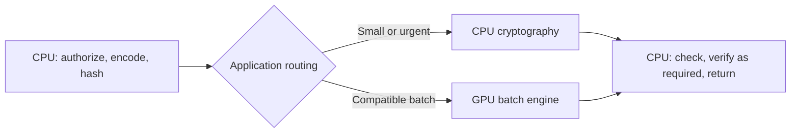

# GPU Batch Crypto

An independent **Apache-2.0 library for batch cryptography on NVIDIA GPUs**, with a native engine, C ABI and Python bindings. Applications can hash records, encrypt or decrypt content with AES-GCM, and generate P-256 ECDSA signatures using reusable device runtimes and public precomputation tables.

**Technical preview, v0.3.** The strongest measured use case is signing many independent records when enough compatible work is ready together. This version adds atomic key-epoch checks, a signer that verifies every output on CPU before returning it, and native CPU/GPU pipeline measurements. Production security and deployment ROI remain explicit evaluation questions.

**Research direction:** make verifiable machine access economical. An agent can
carry scoped permission and payment authority while a publisher controls access
on explicit terms. This library investigates the cost of the required cryptography.
Read the [agent-web research case](docs/AGENT_WEB_RESEARCH.md),
[current protocol landscape](docs/PROTOCOL_LANDSCAPE.md) and
[runnable credential-workload model](benchmarks/credential_workload_model.py)
for the argument, integration boundaries and falsifiable experiments.

## Choose what you need

You can adopt the cryptographic library without the publisher/accounting example.
The Python core works on CPU without building CUDA. Native GPU operations ship
as a separate SDK; examples, benchmarks and public table files stay outside the
Python wheel.

| Your goal | Entry point | Smallest runnable example |
|---|---|---|
| **Use CPU only** | `batchcrypto.Cpu` and key/verification helpers | [CPU quick start](docs/GETTING_STARTED.md#use-cpu-only) |
| **Add GPU signing** | `batchcrypto.verified.VerifiedSigner` + native library | [Guarded GPU quick start](docs/GETTING_STARTED.md#add-gpu-signing) |
| **Generate ES256 tokens** | `batchcrypto.jws.sign_es256` + your CPU/GPU signer | [Token quick start](docs/GETTING_STARTED.md#generate-es256-tokens) |
| **Evaluate access books** | Separate `Authority` / `Offer` / `Clearing` example | [Accounting quick start](docs/GETTING_STARTED.md#evaluate-access-books) |
| **Run a complete HTTP access transaction** | Synthetic buyer, issuer and publisher; recoverable delivery | [HTTP reference and one-command demo](docs/HTTP_REFERENCE.md) |
| Use C/C++ without Python | Installed `batchcrypto::batchcrypto` target and C header | [Native consumer](docs/GETTING_STARTED.md#use-the-installed-c-abi) |
| Reuse tables or model costs | Public P-256 data / standalone Python calculators | [Data and analysis tools](docs/GETTING_STARTED.md#use-data-and-analysis-tools) |

[Component contracts and dependency map](docs/COMPONENTS.md) define purpose,
dependencies, inputs/outputs, failure behavior, application ownership, evidence
and maturity for each component. [Pilot brief](docs/PILOT_BRIEF.md) defines the
buyer, differentiation and joint-benefit questions for a commercial evaluation.

[Release and rollback instructions](docs/RELEASING.md) explain artifact contents,
checks and version pinning. [Contributing](CONTRIBUTING.md) maps proposed changes
to the required correctness, packaging and benchmark evidence.

[Optimization research](docs/OPTIMIZATION_RESEARCH.md) provides bounded tasks
for profiling, CPU/GPU routing, memory transfers and verification costs, with
explicit measurement and acceptance criteria.

## Application and business context

Publishers, CDNs and other infrastructure teams can evaluate the same engine. [Machine-authorized content](docs/MACHINE_AUTHORIZED_CONTENT.md) is one application: signed grants can bind a publisher's content and access terms to a recipient. Payment, identity and enforcement belong to the application.

The [keys instead of clicks thesis](docs/KEYS_INSTEAD_OF_CLICKS.md) explains the business case: an AI buyer pays for authorized content access, a signed credential connects its budget to delivery, and the publisher accrues revenue without requiring a referral click. It distinguishes funded access from key generation, lays out the quote-to-settlement flow, and defines tests for buyer value, publisher proceeds and GPU economics.

The new [funded-access engineering example](docs/ACCESS_BOOK_DESIGN.md) implements scoped prepaid books, atomic CPU purchases, exact resource/terms checks, durable accounting, retry recovery and unused-reservation release with simulated funds. In [28 measured cells](docs/ACCESS_BOOK_RESULTS.md), **35,840 redemptions reconciled**. Fully used 32-item books gave **1.173×** conservative throughput over an optimized single-commit CPU purchase, with slower first-access p99 (up to **18.1 ms versus 6.1 ms**); at 25% use throughput was essentially tied. The editable business model includes funding fees, publisher share, liabilities, utilization and whole-host billing. These are CPU application results; real payment integration and buyer demand remain unproven.

The proposed [agent access design](docs/AGENT_ACCESS_DESIGN.md) prepares required proofs or grants as upcoming calls become ready, uses CPU for small or urgent signing work, and evaluates GPU batches for larger compatible groups. It distinguishes key reuse, concurrent tool calls, issuer authorization and planning overlap from the measurements already published.

The [HTTP reference](docs/HTTP_REFERENCE.md) connects a synthetic buyer, issuer
and publisher with actual loopback requests, simulated funds and recoverable
content delivery. Its [complete access measurements](docs/HTTP_RESULTS.md)
compare unsigned direct purchases, CPU-signed books and guarded GPU books,
including queueing, a controlled planning interval and unused-reservation cleanup.
Across 48 measured cells, **6,924 delivered accesses reconciled**, with 3,218
after the declared one-second deadline. These workloads established **no
repeatable GPU cost advantage**; the raw captures preserve the CPU controls,
late completions and an interrupted earlier run.

[Engineering note](docs/ENGINEERING.md) · [Production security](docs/PRODUCTION_READINESS.md) · [Whole-system measurements](docs/PIPELINE_RESULTS.md) · [Costs and GPU inventory](docs/ECONOMICS.md) · [Historical A100 results](docs/HISTORICAL_BENCHMARKS.md)

A working [ES256 JWS integration](docs/COMPATIBILITY.md) now connects the P-256 engine to standard token consumers. The runnable example and tests verify GPU-produced tokens with PyJWT; existing Ed25519 protocols retain their own keys, format and algorithm policy.

## Where it fits

| Your situation | Current evaluation guidance |
|---|---|
| Fresh P-256 signatures consume meaningful CPU capacity; many records share compatible keys/formats; batches fit the deadline | Evaluate the full-window GPU path against a tuned CPU implementation. Already assembled or offline batches avoid online fill delay. |
| Requests are sparse or urgent, or AES/hash work dominates | Begin with CPU. Small signing batches and every AES/hash cell in the initial matrix favored the stated CPU baseline. |
| Keys must remain in an HSM or another hardware-isolated boundary | This host/device key model does not meet that requirement. Review the security boundary before integration. |
| You need a production service or a proven cost/revenue outcome | Inspect the native pipeline's SLO/overload results and explicit cost assumptions. Network-service validation, deployment economics and independent security review remain open. |

The business question is whether acceleration improves **successful requests within a deadline at an acceptable total cost**. First establish how much fresh signing is necessary: cached signatures or reusable grants may remove work entirely. The [engineering note](docs/ENGINEERING.md) frames the leadership, engineering and security decisions.

## Measured evidence

The [ready-wave token campaign](docs/READY_WAVE_RESULTS.md) adds **100 measured cells and 9,839,257 verified tokens**, including a [separate issuer/consumer verification control](docs/VERIFICATION_CONTROL_RESULTS.md). A 1,024-token, one-key wave with one CPU acceptance check showed a conservative **1.052×** hybrid/CPU goodput ratio at the observed 50 ms quality gate. The added GPU allocation would need to cost less than about **5.2%** of the CPU host allocation for that measured crypto-service case. When the issuer also checks GPU output before a separate recipient verifies it, CPU won both tested sizes. **Use CPU as the starting point for that guarded access path.** These measurements exclude network, ledger and settlement and do not establish a paid-service ROI.

The v0.3 wrapper fixes repeated copying of the entire output buffer for every result. In a paired **batch-4,096** comparison using the same native DLL, full-window signing changed from **195,603 to 1,821,543/s on RTX 4070 Ti**, and **183,581 to 1,364,320/s on RTX 3060**. Mean call times after the fix were **2.25 ms** and **3.00 ms**. One before/after sweep per card, seven timed calls per cell, with every output checked outside timing. [Captures and exact boundaries](docs/DISPATCH_RESULTS.md).

Those are standalone library rates. The [native pipeline experiment](docs/PIPELINE_RESULTS.md) times record creation, hashing, queueing, signing and verification of every signature against a multi-worker OpenSSL CPU baseline. It retains missed deadlines and overload outcomes and **has not demonstrated a reliable hybrid cost advantage at the tested 10 ms target**. [Cost estimates](docs/ECONOMICS.md) distinguish primitive throughput from within-deadline goodput.

The [RTX 3060 follow-up](docs/RTX3060_PIPELINE.md) adds 32 rows with selected-GPU idle checks, shared-host CPU/GPU telemetry, opposite run order and 10/50 ms deadline experiments. It records all-output verification, actual GPU use and cost-per-million coefficients. None of the six paired short-run settings met the 10 ms quality criterion in both modes and repeats; the sixteen-key hybrid run used CPU for every signature.

For comparison, the preserved **v0.2, batch-256** full-window results were:

| GPU | GPU signatures/s | Mean GPU call completion | CPU signatures/s | Paired GPU/CPU rate |
|---|---:|---:|---:|---:|
| RTX 4070 Ti | 224,742–229,039 | 1.12–1.14 ms | 41,218–44,130 | 5.09–5.56× |
| RTX 3060 | 177,810–194,276 | 1.32–1.44 ms | 40,689–43,358 | 4.10–4.77× |

Ranges span two runs with seven timed calls each; ratios use the paired CPU result from each run. The CPU baseline is **one Python thread with cached OpenSSL keys** on a Ryzen 7 7800X3D. GPU timing includes the synchronous Python call, packing, transfers, execution, output construction and clearing. It excludes batch formation, queueing, key/table import and independent oracle checks. These are library measurements, not request latency, a multi-core CPU comparison or cost savings.

In those v0.2 captures, full-window first beat CPU at sampled batch **64** on both cards; batches **1 and 8 lost**. Batch 256 was the most consistent mid-size point of that implementation. The output-copy correction changes large-batch behavior; neither that old recommendation nor a new primitive peak defines an online service's optimal batch. [All four older captures](docs/P256_RESULTS.md) remain available.

The [A100 archive](docs/HISTORICAL_BENCHMARKS.md) includes **110,200 P-256 signatures/s** and **399,446 AES-GCM seals/s** on 16-byte records from an earlier persistent engine. It also preserves L40S latency, earlier RTX measurements and rejected runs. Those execution paths differ from the current library; their numbers are not a ranking against this table. The [initial public matrix](docs/RESULTS.md) preserves the AES/hash results where CPU won every sampled cell.

## Why batching, and why keep the CPU involved?

GPU submission, copying and synchronization have costs. Batching shares those costs and provides independent work for parallel execution. Small batches may spend more time on that overhead than a CPU needs to finish the work. CPUs also benefit from batching, cached keys and efficient native execution, so the next system comparison must tune both paths.

A useful integration keeps authorization, encoding, hashing and routing on the CPU; sends compatible signature batches to the GPU; and checks and processes results on the CPU. Small or urgent work can take an explicit CPU path. Hashing content first means a signing call transfers 32-byte digests and returns 64-byte signatures, rather than transferring entire content objects.



The library supplies CPU operations and GPU runtimes; application policy controls routing, queues and deadlines. A separate [native benchmark](benchmarks/native) implements bounded in-process queues and CPU/hybrid routing for evaluation. It is not a production service or automatic routing inside the library. The [systems design](docs/SYSTEMS_DESIGN.md) explains the boundary.

**Batch fill time can dominate the result.** In a simple steady-arrival model, collecting 256 compatible items adds 1.275 ms average wait at 100,000 items/s, but 127.5 ms at 1,000/s, before execution. Total traffic split across many signing keys can behave like the latter case. These are calculated illustrations, not measured service latency. See [batch sizes and latency](docs/BATCHING.md) and the [worked system model](docs/SYSTEMS_DESIGN.md).

## Evidence you can inspect

| Evidence | Where to inspect it |
|---|---|
| Independently buildable native library, public ABI, Python bindings and direct C consumer | [Engine](src/engine/crypto_engine.cu), [header](include/batchcrypto.h), [C example](examples/c_api.c), build instructions below |
| Local GPU correctness, epoch, output-failure and bounded-input checks; all 4,479 public table points matched OpenSSL | [Validation record](docs/VALIDATION.md), [tests](tests), [table generator](tools/generate_p256_tables.py) |
| Native multi-worker CPU comparison, queue/verification latency, overload accounting and explicit price scenarios | [Pipeline](docs/PIPELINE_RESULTS.md), [costs](docs/ECONOMICS.md), [raw captures](benchmarks/pipeline_results) |
| 96 current backend result rows; every measured GPU signature checked; both repeat runs retained | [Results and provenance](docs/P256_RESULTS.md), [raw captures](benchmarks/p256_results), [verifier](benchmarks/verify_p256_results.py) |
| Explicit limits on security and portability claims | [Security scope](SECURITY.md), [validation](docs/VALIDATION.md); hosted CI checks CPU behavior and evidence, not CUDA execution |
| License, selected-source attribution and public/private boundary | [Apache-2.0](LICENSE), [NOTICE](NOTICE), [EXTRACTION.json](EXTRACTION.json), [architecture](docs/ARCHITECTURE.md) |

## Inspect the implementation

| Component | Source | Responsibility |
|---|---|---|
| Cryptographic execution engine | [crypto_engine.cu](src/engine/crypto_engine.cu) | Validate and pack batches, dispatch CUDA work, return checked results |
| Device runtime and buffers | [runtime.hpp](src/engine/runtime.hpp) | Device selection, stream ownership, reused buffers, clearing, resident public tables |
| Native ABI implementation | [batchcrypto_abi.cpp](src/abi/batchcrypto_abi.cpp) | Opaque contexts, keys/epochs, status handling and C entry points |
| Public C ABI | [batchcrypto.h](include/batchcrypto.h) | Versioned interface for C, C++ and language bindings |
| CUDA kernels | [crypto_kernels.cuh](src/kernels/crypto_kernels.cuh) | AES-GCM, SHA-256, P-256 signing and public-key export |
| P-256 table-backed multiplication | [fixed_base.cuh](src/p256/fixed_base.cuh) | Reference, fixed-window comb and full-window execution |
| Public comb/full-window tables | [data/p256](data/p256) | Checked-in point data, typed layouts, metadata and SHA-256 fingerprints |
| Table generator and verifier | [generate_p256_tables.py](tools/generate_p256_tables.py) | Rebuild and independently check all 4,479 public points against OpenSSL |
| Python runtime | [batchcrypto](python/batchcrypto/__init__.py) | Thin bindings to the same C ABI |
| Guarded signing boundary | [VerifiedSigner](python/batchcrypto/verified.py) | CPU public-key pin, required epoch, all-signature verification and failure quarantine |
| Whole-pipeline benchmark | [pipeline.cpp](benchmarks/native/pipeline.cpp) | Native OpenSSL workers, bounded queues, optional GPU dispatch, request deadlines and accounting |

The runtime is reusable across calls; the current execution model launches bounded CUDA batches. The historical persistent queue/scheduler is a different implementation and is not part of this native library. See [architecture](docs/ARCHITECTURE.md) and [P-256 tables and backends](docs/P256.md) for the exact boundary.

## Included

| Operation | CUDA | CPU/Python |
|---|---|---|
| AES-256-GCM seal/open, 96-bit nonce, 128-bit tag | Yes | cryptography/OpenSSL |
| Associated data and payloads up to 1 MiB | Yes | Yes |
| SHA-256 variable-length batch hashing | Yes | hashlib |
| P-256 ECDSA signing of SHA-256 digests | Reference, comb_w8 and full_window_w8; deterministic nonces and low-s | Yes |
| P-256 public-key export | Yes | Yes |
| P-256 verification and key generation | — | Yes |

P-256 names the curve; ECDSA is the signing algorithm used with it. AES-GCM protects content and authenticates associated metadata. ECDSA can authenticate a publisher's content manifest or an authorization receipt. Neither primitive implements billing, settles payments, or prevents copying by a recipient who has plaintext.

RSA is not required for this combination and is not included. An RSA signature would be an alternative for a protocol that requires it. This release does not implement TLS, WebAuthn, or a complete paid-access protocol.

## Build the native library

Requirements: CMake 3.24+, a compatible C++ compiler, NVIDIA CUDA toolkit, and a supported NVIDIA GPU/driver. The native build has no Python, PyTorch, Go, or OpenSSL dependency.

```sh
cmake -S . -B build -DCMAKE_BUILD_TYPE=Release -DCMAKE_CUDA_ARCHITECTURES=89
cmake --build build --config Release
cmake --install build --config Release --prefix ./dist
```

Choose the architecture for your GPU (for example, 86 for RTX 3060 or 89 for RTX 4070 Ti). Windows output is `build/Release/batchcrypto.dll`; Linux output is `build/libbatchcrypto.so`. Use a CUDA version compatible with your compiler. The local Windows validation uses CUDA 13.0 and Visual Studio 2022.

Include [`batchcrypto.h`](include/batchcrypto.h) and link the library from C or C++. All public native functions accept **host memory**, execute synchronously, and report call-level plus per-item status. Decryption checks the authentication tag before writing plaintext; an invalid item returns `BC_AUTH_FAILED` with its output zeroed.

## Python quick start

Install the Python package and its CPU dependency; this does **not** build or
require the native library. The GPU examples additionally need the native SDK:

```sh
python -m pip install .
python examples/cpu_only.py
```

For signing, use the guarded signer around an owned runtime. Its buffers and key slots persist across calls. This example assembles 256 records before submission and verifies the whole output batch against a CPU-derived public-key pin before returning it:

```python
from batchcrypto import Cpu, generate_p256_key
from batchcrypto.verified import VerifiedSigner

# Already assembled records: CPU preparation, GPU batch signing, CPU verification.
records = [f"example record {i}".encode() for i in range(256)]
digests = Cpu().sha256(records)

with VerifiedSigner("build/Release/batchcrypto.dll", device=0) as signer:
    epoch = signer.load_key(0, generate_p256_key())
    signatures = signer.sign(0, digests, expected_epoch=epoch)
    print(len(signatures))
```

`VerifiedSigner` requires native v0.3 and defaults to full-window; it does not protect keys against the documented side channels or host access. `reference` remains the general `Runtime` default. A `Runtime` caller can use `set_p256_backend(...)` and `sign(..., expected_epoch=epoch)` directly, with independent verification supplied by the application. The C equivalents include `bc_set_p256_backend` and `bc_sign_at_epoch`; [`examples/c_api.c`](examples/c_api.c) exercises the ABI.

AES nonces remain the caller's responsibility. Retiring a key makes its slot unusable and retains an epoch tombstone so a stale update cannot silently recreate it. Key replacement waits for that context's active batch to finish. Reports include the key epoch used.

The stateless API below demonstrates encryption, decryption and signing with an explicit native-library path. It creates temporary runtimes; use the owned runtime above for repeated work. A single-record example is not a GPU performance recommendation:

```python
import hashlib
import os
from batchcrypto import Cuda, Record, generate_p256_key, public_key, verify_p256

crypto = Cuda("build/Release/batchcrypto.dll", device=0)
key = os.urandom(32)                  # fresh content key for this example
nonce = os.urandom(12)                # never reuse a nonce with the same key
aad = b"publisher=example.test;article=1;version=1"
ciphertext = crypto.seal(key, [Record(nonce, b"article content", aad)])[0]
plaintext = crypto.open(key, [Record(nonce, ciphertext, aad)])[0]
assert plaintext == b"article content"

signing_key = generate_p256_key()
digest = hashlib.sha256(b"publisher manifest").digest()
signature = crypto.sign(signing_key, [digest])[0]
assert verify_p256(public_key(signing_key), digest, signature)
```

Use `Cpu()` for the explicit CPU backend. `Cuda()` never silently falls back to CPU. Python `open()` returns `None` for an item whose authentication fails. Invalid shapes and native execution errors raise exceptions. Signatures are fixed-width big-endian `r || s`, not DER.

Run the [machine-authorized content example](examples/content_grant.py) and [signed batch records](examples/signed_batch_records.py):

```sh
python examples/content_grant.py --library build/Release/batchcrypto.dll
python examples/signed_batch_records.py --library build/Release/batchcrypto.dll
```

## Check correctness and benchmark

CPU reference tests:

```sh
python -m unittest discover -s tests -v
```

For actual CUDA tests, set `BC_LIBRARY` and optionally `BC_DEVICE`:

```powershell
$env:BC_LIBRARY = (Resolve-Path build/Release/batchcrypto.dll).Path
$env:BC_DEVICE = "0"
python -m unittest discover -s tests -v
```

Linux: `BC_LIBRARY="$PWD/build/libbatchcrypto.so" BC_DEVICE=0 python -m unittest discover -s tests -v`.

For the reproducible three-primitive runtime matrix, commit the source and run:

```sh
python benchmarks/run_matrix.py --library build/Release/batchcrypto.dll --build-dir build --device 0 --iterations 3 --output benchmarks/results/device0.json
```

The matrix also measures authenticated decryption. It records the source commit/hashes, compiler, CUDA toolkit, driver, GPU, CPU, full samples, accounting, and correctness. See [benchmark methodology](docs/BENCHMARKS.md).

Benchmark timings cover the synchronous library call, including packing, allocation, transfers, GPU execution and cleanup. Every measured result is compared with the CPU implementation outside the timed interval. Old Smoke throughput numbers are not performance claims for this new library.

## Limits and ownership

Maximum 4,096 items per call, 1 MiB plaintext per item, 64 KiB associated data per item, and 64 MiB aggregate input/output/AAD working data. One key is used per batch. Calls within a runtime serialize; independent runtimes have separate streams, buffers and keys, and can select different devices. There is no implicit GPU scheduler or automatic batch formation. The caller owns authorization, persistent key storage, rotation policy, and unique AES nonces across calls, processes and restarts; the library rejects duplicate nonces within a seal batch only.

Private keys are present in host and GPU memory. Cleanup attempts to overwrite library-owned buffers, but is not a secure-erasure or hardware-isolation guarantee. Python immutable objects cannot be reliably scrubbed. The inherited arithmetic includes secret-dependent control flow and memory access; no constant-time, side-channel resistance, FIPS validation, HSM equivalence, or independent security-audit claim is made. See [SECURITY.md](SECURITY.md).

## License and origin

[Apache-2.0](LICENSE). [`EXTRACTION.json`](EXTRACTION.json) records source paths and hashes for selected files; [`NOTICE`](NOTICE) preserves attribution. Modified extracts are identified in their headers. Only selected source code is carried over; public examples use synthetic content and generated test keys.

Read [architecture and the public/private boundary](docs/ARCHITECTURE.md), [machine-authorized content](docs/MACHINE_AUTHORIZED_CONTENT.md), and [security scope](SECURITY.md).
