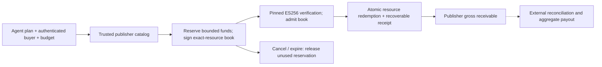

# Engineering funded access with fewer repeated costs

The useful product is **budgeted access to content that an AI buyer values**.
The credential connects an approved budget, exact content and terms to an
accounting event. Publisher revenue comes from that funded event. Faster key
generation cannot create revenue or make unwanted content valuable.

This repository now includes an original, executable [access-book example](../examples/access_book/engine.py)
and [durable CPU measurements](ACCESS_BOOK_RESULTS.md). It implements enough
accounting to test the idea while keeping the native crypto library generic.
It is an evaluation component, not an operating payment platform. No private
application code, private schemas, live accounts or signing keys were copied.

## Three decisions that matter economically

1. **Aggregate funding and payout.** A recurring buyer funds an account or uses
   a contractually backed credit arrangement. Resource purchases update an
   internal ledger; they do not each initiate a card payment. Publishers receive
   reconciled aggregate payouts. This example only seeds simulated balances;
   real funding, custody, refunds, payout and reconciliation adapters remain work.
2. **Use the smallest sufficient authorization.** A small, immediate purchase
   can issue, verify and redeem in one transaction when those steps share an
   authority. A known list of resources can use one short-lived signed book,
   verified once, with individual atomic redemptions as resources are needed.
   Do not issue a new asymmetric key for each website or tool invocation.
3. **Accelerate remaining compatible work only when measured.** CPU is the
   default. If many independent book issuances later consume material signing
   capacity, their digests can form GPU batches. Use the existing guarded GPU
   signer and include its verification, scheduling and operating costs. Reducing
   the number of signatures raises the traffic needed to justify GPU allocation.

This is an application design that an infrastructure provider can evaluate.
Cloudflare's Pay Per Crawl already supplies a price/intent flow and a Merchant
of Record role; this example neither replaces those services nor establishes
wire compatibility with them. A production adapter must honor the provider's
identity, signature and billing profile. [Cloudflare documentation](https://developers.cloudflare.com/ai-crawl-control/features/pay-per-crawl/what-is-pay-per-crawl/).

## Implemented flow and trust boundary



The clearing example uses **one authoritative SQLite database**, a cached CPU
P-256 signing key and an independently pinned verifier. Identities passed to
methods represent previously authenticated callers. The example does not
authenticate an HTTP client. Only a trusted publisher can populate the catalog.
All amounts are integer simulated micro-USD. A book is restricted to one buyer,
one publisher, `content:read`, at most 256 unique resources and at most 300
seconds. Prices come from the authoritative catalog and the sum cannot exceed
the buyer's maximum or available balance. Redemption must match the content
and terms hashes the buyer requests; a terms mismatch spends nothing.

The standard ES256 JWS binds the issuer, audience, buyer, random book ID,
times, item count, total reserved value and SHA-256 commitment to the complete
ordered manifest. The payload is small even when the manifest has many items.
The current consumer has the authoritative manifest in its trusted database;
no Merkle proof or custom signature scheme is necessary. An external consumer
would need a manifest exchange and online redemption protocol. This is a new
experimental profile, not an existing KeyBook, HTTP Message Signature or
Cloudflare protocol version.

Admission verifies the signature and exact stored claims once, then persists
that result. Subsequent requests use the random book ID as a database reference,
not as a bearer credential. Every new redemption still checks authenticated
buyer and publisher, admitted/closed state, current key revocation, server time,
resource, content hash, terms hash and unused status. Local cache admission does
not grant offline spending rights. A second replica with an independent spent
set would invalidate this design; a deployed service needs a shared serializable
authority and a defined failure policy.

`purchase()` is the optimized co-located path: issue, verify and redeem under
one durable transaction, with savepoints for composed steps. A signature failure,
wrong content, wrong terms or failed receipt write rolls back the entire purchase.
The comparison also permits book issuance and admission to share a transaction.
This avoids making a performance claim depend on unnecessary commit boundaries.

## Accounting, retry and failure behavior

| Event | State change |
|---|---|
| Issue accepted book | Buyer available decreases; reserved increases by the same amount; publisher accrual remains zero |
| Admit book | Verify pinned ES256 and claims, then mark admitted; no charge |
| Redeem unused resource | Atomically reduce book/buyer reservation, increase buyer redeemed total and publisher gross accrual, insert immutable receipt |
| Exact retry | Return the same book or receipt; never reserve or charge a second time |
| Retry ID reused for different input | Deny without changing balances |
| Same resource with a different retry ID | Deny as already redeemed |
| Cancel or trusted expiry cleanup | Close book; return only unused reserved value to buyer available balance |
| Expired, closed or revoked book | Deny new work; direct receipt recovery remains possible and conveys no new access |
| Failure before commit | Roll back; a retry may attempt the purchase again |
| Commit succeeds but response is lost | Recover the existing receipt from the authoritative ledger |

The invariant is `initial = available + reserved + redeemed`. Book reservations
reconcile to buyer reserved balances; receipts reconcile to buyer redeemed
balances and publisher gross accrual. The model charges for a **committed,
recoverable access entitlement**, not proof that bytes reached a reader or that
an AI used them. The delivery adapter must retain the entitled content version
for the agreed recovery period and expose authenticated receipt recovery.
Receipts in this example are database records, not signed settlement receipts.

Charging only after delivery is a different distributed transaction problem:
timeouts cannot prove non-delivery. It needs a defined delivery/compensation
policy, durable outbox, idempotent external adapters and tests for ambiguous
network outcomes. An expiry worker must actually call release; clock expiry
immediately denies new access but does not automatically run a refund process.
The demo invokes release explicitly. The CPU clock and database are trusted.

The engine credits 100% of simulated gross spend to publisher receivables.
The economic model's illustrative 85% publisher share is a separate scenario;
a real agreed fee split would need its own ledger accounts and reconciliation.
Unspent buyer balances and unpaid publisher accruals remain liabilities.
If a processor deducts fees from incoming funding, credit only backed principal
or explicitly supply the working capital covering those fees. The simulation's
fixture seeding function must never be exposed as a live funding endpoint.

## How an agent should prepare work

Group by publisher and known terms after receiving authoritative prices. Reserve
only the budget the buyer approved. Start with modest books (8–32 resources)
when likely consumption and deadlines justify preparation; this is a starting
policy for evaluation, not a demonstrated universal optimum. Large books increase
reserved funds, scope and first-access work. A single urgent request can use the
atomic CPU path immediately. The current prototype has explicit paths; it does
not predict plans or implement an automatic routing controller.

The co-located control measured a 1.173x conservative full-use throughput ratio,
but book first-access p99 reached 18.11 ms versus 6.08 ms for atomic purchases.
This does not satisfy a 10 ms first-access target. The 25%-use throughput ratio
was 1.008x, effectively a tie in these two observations. Planning overlap could
move preparation off the critical path, but that has not been measured. A
32-item book here reduces signatures by 32x, not end-to-end service cost by 32x.

The scheduler should use measured `(publisher, operation, algorithm, key epoch)`
compatibility, expected consumption, budget exposure and remaining deadline.
Do not group unrelated publisher authorizations under a shared secret, trust
a client's price, or wait for GPU batch fill when an access deadline is near.
An agent may plan 100 websites but consume only a few. The cancellation experiment
therefore compares speculative books against an on-demand baseline that skips
unused work. Bundling is useful without being the only efficient design.

## Commercial test and decision gates

The strongest first test is recurring access to rights-cleared, current or
specialist information that improves a buyer's answer. Test the cheaper/free
alternative too. The architecture makes small purchases technically manageable;
it cannot establish a publisher's right to license content or a buyer's desire
to pay. Avoid treating crawling volume as a demand forecast.

Use the [editable model](../benchmarks/access_business_model.py) to enter actual
funding fees, expected funded-spend fraction, payment risk, publisher share,
payout frequency, egress, operating cost and traffic. Preserve the whole-host
minimum, idle capacity and unpaid liabilities. At $0.001 access, a fee schedule
or a small support burden can overwhelm platform margin. Enterprise invoicing,
repeated funded purchases and aggregate payouts may fit better; their terms and
costs must be verified, not assumed free. A higher price requires higher buyer
value, not simply a more expensive credential.

A proposed bounded pilot (no outreach, payments or enrollment performed here):

- Obtain rights and a rate card from a few specialist publishers. Use a
  payment/settlement provider with the required business arrangement.
- Predeclare 100 representative buyer tasks, free-baseline answers, a fixed
  spending ceiling and blinded comparisons. Record offered, accepted, declined,
  completed, refunded and repeated purchases; do not count simulated consent as
  paid demand.
- Measure buyer value per successful task, repeat willingness to pay, publisher
  net proceeds and payout delay, support/refund cost, and whole-service p95/p99
  latency. Keep the declined and failed tasks in the denominators.
- Continue only if recurring buyers and publishers both benefit and the actual
  contribution covers a realistic fixed-cost budget. Prefer a subscription or
  direct account integration if reusable standard entitlements solve the same
  problem more cheaply. That is a viable result, not a reason to add crypto.

## Run and inspect

```sh
python -m pip install '.[interop]'
python examples/access_book_demo.py
python -m unittest discover -s tests -p 'test_access_book.py' -v
python benchmarks/verify_access_book.py
python benchmarks/report_access_book.py --check
```

The tests cover budget conservation, exact scope, wrong identities, pinned
verification, retry conflicts, concurrent spending, rollback, restart recovery,
expiry, revocation and cancellation. SQLite FULL commits and those tests do not
establish crash/power-loss durability, multi-host consistency or production
payment safety. Authentication, catalog administration, rate limiting, key
rotation, bounded storage/retention, migrations, replica recovery, payout
reconciliation and independent review remain deployment requirements.
The [GPU security limitations](PRODUCTION_READINESS.md) continue to apply if a
GPU issuer is added; this design creates no HSM or constant-time guarantee.
