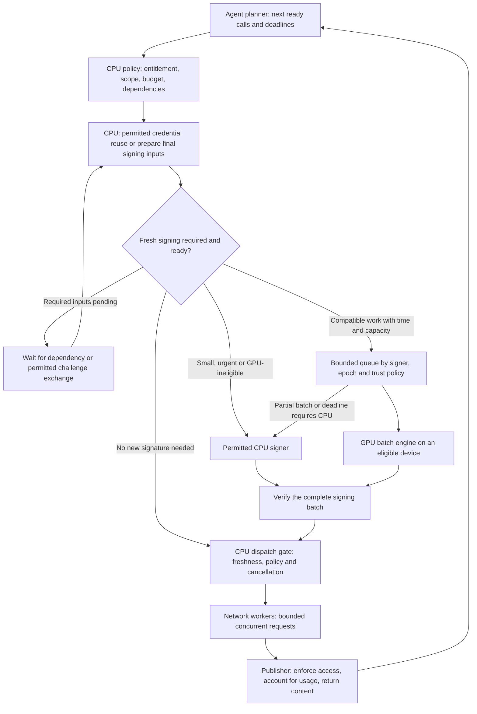

# Preparing machine access with a heterogeneous CPU–GPU stack

The [keys instead of clicks thesis](KEYS_INSTEAD_OF_CLICKS.md) supplies the
business context: funded access credentials can connect machine consumption
to publisher compensation. It separates settlement batching, access bundles
and cryptographic batches. This note describes the proposed scheduling and
authorization design for that last layer.

An agent that knows several upcoming tool or content-access calls can prepare
their authorization material while other independent work continues. Small or
urgent signing jobs can finish on CPU. Larger groups of compatible, authorized
signing jobs can be evaluated for GPU execution. This is an application design
for reducing cryptographic work on the critical path and managing its total
cost; its value depends on the actual protocol and traffic.

**Proposed integration, not a measured agent service.** The repository supplies
the CPU operations, CUDA engine, C ABI, reusable runtimes and guarded signer.
The planner, policy service, credential lifecycle, network client, publisher
integration and payment ledger described here remain application components.
The [engineering note](ENGINEERING.md) and [systems design](SYSTEMS_DESIGN.md)
connect this proposal to the implementation and published evidence.

## Start with the right unit of work

A tool call is an application action. An HTTP request is a transport action.
A signature, verification or encryption is a cryptographic operation. Their
counts need not match: one tool call can issue several HTTP requests, reuse
an existing credential, or require several new cryptographic operations.

The routing input is **ready cryptographic work per compatible signing group,
with its remaining deadline**, rather than the number of websites on a list.
Four websites could require no new signatures. One publisher could need
hundreds of distinct grants for a single retrieval wave.

Batching is one efficiency mechanism. Concurrent independent requests, cached
content, reusable credentials, connection reuse, native CPU batching and
multiple CPU workers can also help. HTTP/2, for example, supports concurrent
streams on a connection; this is separate from batching cryptographic jobs
and does not combine unrelated origins into one authorization domain.
[HTTP/2 streams](https://www.rfc-editor.org/rfc/rfc9113.html#section-5).

## Prepare proofs or grants; manage keys by lifecycle

Generating a new signing key for every website is not the default fast path.
The owner establishes a key and its trust relationship, then uses it for the
operations its lifecycle and policy permit. Selecting an existing key and
preparing a fresh signed object are different from generating a new key pair.
Privacy or protocol requirements may require separate keys by origin, tenant
or session; batch size is never a reason to weaken that separation.

| Material | Owner and normal preparation point | Meaning for this library |
|---|---|---|
| Agent/client proof key | Client or its authorized credential service; established for the identity/session/origin scope required by the protocol | CPU key generation and P-256 signing are available. A client signature alone grants no publisher access. |
| Publisher/issuer signing key | Publisher or explicitly delegated issuer; established and rotated under its key policy | Reuse one permitted key and epoch for many independently bound grants. Agent callers do not receive this private key. |
| Content encryption key | Publisher/content service; generated and scoped according to the content-encryption design | AES-GCM is available, but authorized key delivery and durable nonce allocation are application work. Existing evidence favors CPU AES. |
| TLS session secrets | HTTPS implementation, according to its handshake and resumption rules | TLS and ECDH/key agreement are outside this library. P-256 ECDSA here is a signature operation. |

Application request identifiers, freshness challenges and AES-GCM nonces are
also distinct. AES-GCM requires nonce uniqueness under a key across workers
and retries. The signer derives its ECDSA nonce internally; applications
should not manage a stockpile of ECDSA nonces. Key creation uses an approved
randomness source/keystore, not language-model output.

Different access protocols create different workloads. A bearer-token flow
does not inherently require the client to generate a new signature for each
request. [OAuth bearer-token usage](https://www.rfc-editor.org/rfc/rfc6750.html#section-2).
In contrast, DPoP defines a unique signed proof for each HTTP request, binding
request method and target URI, freshness information, and the access token
where applicable. A server challenge can prevent finishing that proof in
advance. DPoP supplements a valid key-bound token; proof possession alone
does not authorize access. [DPoP request proofs](https://www.rfc-editor.org/rfc/rfc9449.html#section-4).

Those standards illustrate workload differences. This repository implements
neither OAuth/DPoP nor a general HTTP-signature adapter. Its content-grant
example has its own explicit encoding and trust inputs; raw P-256 signing
alone does not implement a wire protocol.

## Separate the client and publisher roles

On the **agent side**, the planner can identify upcoming calls, reuse permitted
credentials and prepare required client proofs. On the **publisher side**,
the access service validates entitlement, enforces terms and issues any new
grant or receipt. A signature can bind those facts to a content version and
recipient; permission and accounting come from the publisher's service.

One issuer may accumulate compatible grant requests from many agents even
when each agent visits only a few websites. That is a plausible aggregation
point for the library, subject to trust policy. Conversely, many websites with
independent issuer keys may produce many small signing groups. A shared
gateway can pool their grants under one issuer key only if that delegation is
actually authorized and accepted by the publishers and consumers. It changes
the trust model and cannot be assumed merely to improve performance.

The current signing ABI uses **one key slot per call**. Shared public comb or
full-window tables do not merge private keys or signing authorities. One
permitted client key can sign separate destination-bound proofs in a batch
when the protocol and origin/privacy policy allow it; each proof remains an
independent object for its own destination.

## Use each ready planning wave

Search results often determine which sites an agent visits next. The scheduler
therefore operates on successive sets of independent, ready calls, not an
assumption that the entire task is known at its start. Release useful work as
soon as its dependencies permit, including while the model plans later work.



The same CPU/GPU signing pattern can sit behind the publisher's grant service.
It does not imply the agent can perform the publisher's authorization step.
Cached credentials also pass the dispatch policy and freshness gate.
Network workers can send each completed authorized group independently;
there is no requirement to wait for every website or the slowest group.

The proposed application work record contains a request ID, parent tool-call
ID, destination, operation, authenticated principal, signer/tenant, intended
key epoch, protocol/encoding version, relevant scope/content/terms versions,
deadline and cancellation state. It references keys through the credential
service. Private keys and reusable credentials stay out of the model prompt
and general planning logs.

Only finalize signed bytes once every required input and authorization
decision is known. Unknown content hashes, prices, recipient identities,
request bodies or fresh server challenges can block early signing. The exact
fields depend on the protocol; the list above is an application work record,
not a claim about DPoP's signed fields.

## Place work using time, compatibility and current capacity

| Ready workload | Proposed starting policy | Why |
|---|---|---|
| A few urgent accesses with valid reusable credentials | Dispatch through the CPU/network path | There may be no fresh asymmetric signing work to accelerate. |
| A few new signatures or many distinct keys with small groups | Native CPU, with bounded concurrency and CPU batching where useful | Avoid waiting to fill a GPU batch; the current ABI cannot combine different signing keys in one call. |
| A large, already prepared group under one permitted signer and epoch | Compare CPU batching with GPU signing plus full completion costs | Batch-fill wait can be near zero because the work is already ready. Submission, queueing and verification still cost time. |
| Compatible work arriving gradually with available slack | Bounded size/timeout batching; choose CPU or GPU from measured profiles | Aggregate arrival rate alone cannot establish a deadline-safe batch. |
| Busy inference GPU, busy host CPU, or long device queue | Use another permitted resource, admit less work, defer or reject under policy | An idle second GPU still depends on CPU preparation, dispatch and verification. |

A router estimates completion time for both permitted paths using current
queue state and profiles for the actual batch size, key pattern, verification
policy and device. GPU eligibility requires the remaining budget to cover
fill wait, device queueing, the complete library call, verification and a
margin for uncertainty. A mean kernel time is insufficient for that decision.
Select the path that meets the deadline at the intended resource cost; GPU
occupancy by itself is not the objective. The old batch-64 crossover is an
experiment starting point, not a website-count routing rule.

Give urgent items a separate CPU lane when permitted, instead of holding
them behind a large batch. An in-flight public GPU call is synchronous; this
library does not provide per-item cancellation or streaming completion.
The guarded signer verifies the complete batch before releasing any result.
Smaller independent batches may therefore improve time to the first useful
tool result even when a larger batch has higher primitive throughput.

If model inference shares the machine, account for its CPU and GPU demand.
An isolated crypto worker pool or a separate device/host is a deployment
option to test, not a guarantee of isolation. Offloading crypto to the same
GPU used by the model can delay inference and erase the intended benefit.

## Overlap can reduce waiting without removing compute cost

Once authorized signing inputs become stable, suppose cryptographic
preparation takes `T_crypto` and independent useful work leaves an overlap
window of `W`. A simple dependency model gives:

```text
additional critical-path wait = max(0, T_crypto - W)
```

For example, a hypothetical 4 ms preparation finishing during 10 ms of
independent planning adds no wait at dispatch. With only 1 ms of independent
work, it adds 3 ms. These are calculations, not measurements. Both CPU and
GPU implementations receive the same opportunity to prepare work early.
When stages contend for resources, their times can change and this simple
overlap model no longer predicts task latency by itself.

An already prepared wave can remove the arrival-driven fill delay modeled
in [the systems design](SYSTEMS_DESIGN.md#traffic-per-compatible-key-determines-fill-time).
It cannot remove transfer, scheduling, verification or network work, or
repair the deadline misses in the published experiments. If plans change,
prepared-but-unused work still consumes CPU/GPU time and may expire before
use. Measure time to first useful result, task completion time and total
resource cost, including that wasted work.

## Preserve the access and payment boundaries

The planner proposes actions; deterministic application policy decides what
may run. Check entitlement, destination, spending limits and signing scope
before preparation. Revalidate applicable cancellation, expiry, revocation
and policy state before dispatch. A changed plan or signed field requires
discarding or explicitly rebuilding the affected object. The native required
epoch check prevents using a changed key generation; it does not implement
the application's authorization or revocation database.

Use each publisher's accepted grant/proof format and trust anchors. Apply
its replay/freshness rules and preserve audience/content/terms binding.
CPU fallback is eligible only where key policy permits CPU execution; a
GPU path or fallback must not export an HSM-held key outside its boundary.
Deployment also depends on the existing [production security requirements](PRODUCTION_READINESS.md),
including the current GPU implementation's secret-dependent execution.

Speculative preparation must not silently become a purchase. Paid access
requires explicit application authorization, stable request/accounting IDs,
retry deduplication and a defined charge/refund point consistent with the
publisher's contract. An unused signed artifact does not by itself prove
delivery or a billable event. Issuer keys, durable nonce allocation, replay
state, key release and payment settlement remain outside this engine.

## What would establish the benefit

The subsequent [ready-wave experiment](READY_WAVE_RESULTS.md) measured the
already-ready signing portion of this design: standard ES256/EdDSA objects,
native workers, wire encoding and CPU verification. The one-check ES256 case
at 1,024 tokens had a narrow cost ceiling; a
[separate issuer/consumer verification control](VERIFICATION_CONTROL_RESULTS.md)
favored CPU. These runs do not simulate model reasoning, network delivery,
cancellations or overlapping planning. They establish a more specific
cryptographic workload result while leaving those application dimensions
distinct.

The [RTX 3060 pipeline campaign](RTX3060_PIPELINE.md) tested planned constant
arrival rates on a shared host. Its sixteen-key hybrid case performed every
signature on CPU; its deadline results did not establish a repeatable cost
advantage. It did **not** test an agent's already-ready planning waves or
overlap with model work. That creates a distinct testable hypothesis, not
an explanation that converts those results into a win.

Use a recorded or explicitly synthetic dependency trace with stable-input
times, request deadlines, key groups, cancellations and challenge-dependent
calls. Replay exactly the same trace through these paths:

1. CPU with native batching, cached permitted credentials and early preparation.
2. Hybrid with the same reuse, early preparation, security checks and CPU budget.
3. A control with early preparation disabled, to separate scheduling gains
   from GPU gains in both paths.

Compare ready waves of 1, 8, 64 and 256 fresh signatures; one versus sixteen
independent signing groups; zero versus available planning overlap; and
idle versus deliberately documented inference contention. These are proposed
experiment dimensions, not a new benchmark claim or a calibrated production
configuration. Fix a bounded matrix, deadlines and acceptance criteria before
running it; do not equate 256 calls across sixteen keys with a batch of 256.

Report cryptographic operations per access, actual batch/GPU use, verified
deadline goodput, first useful result and task completion p50/p95/p99,
rejected/late/expired work, prepared-but-unused or repeated operations,
process CPU time, GPU use, network/issuer latency and allocated cost. Price
both per delivered access and per completed useful task. A benefit must
survive the tuned CPU baseline and the required security and access policy.

The publisher-facing proposition is affordable, authenticated machine access
with explicit permissions and auditable accounting. The engine can support
the cryptographic part; publisher adoption, delivery, payment and demonstrated
system economics complete that proposition.
