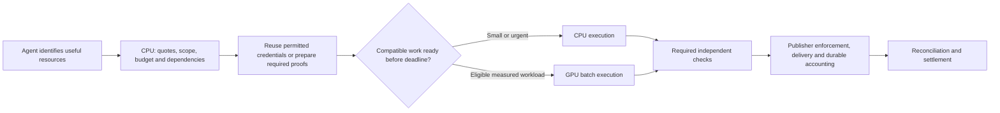

# A research case for verifiable machine access

**The agent web needs a low-cost way to carry verifiable permissions and
payment authority across independent services.** A publisher should be able
to offer useful content on explicit terms, an AI buyer should be able to act
within a budget, and both should be able to reconcile what was authorized and
delivered. A human referral click need not be the unit that funds the exchange.

GPU Batch Crypto investigates the execution cost of the cryptographic work
inside that design. Its contribution is an open Apache-2.0 engine, independently
usable components, public measurements and falsifiable system experiments.
The research objective is lower cost per correctly authorized operation under
a deadline. This leaves CPU execution, caching and reusable permissions as
first-class outcomes, and gives GPU acceleration a measurable admission rule.

## Why this is a concrete research direction

Machine authentication, purchase authority, private credentials and priced
resource access are already receiving protocol and product work. Web Bot Auth,
AP2, Privacy Pass and x402 address different parts of that system. Cloudflare's
Monetization Gateway announcement connects resource access to payment at the
edge. The [dated protocol map](PROTOCOL_LANDSCAPE.md) links primary sources,
distinguishes drafts from products, and records this library's integration gaps.

The proposed research contribution is **workload-aware cryptographic execution
across those boundaries**. The unresolved question is where interoperable,
privacy-respecting proof work becomes large enough to merit a different execution
strategy. Traffic growth alone does not answer it. Nor does an isolated hash
rate or a signature benchmark against one Python thread.

The [keys instead of clicks thesis](KEYS_INSTEAD_OF_CLICKS.md) defines the paid
content transaction; the [pilot brief](PILOT_BRIEF.md) defines buyer and publisher
value. This research note addresses the engineering argument beneath them.

## Separate four responsibilities

| Responsibility | Question answered | Required mechanism |
|---|---|---|
| Identity or issuer authentication | Who made this claim or request, under whose trust policy? | Trusted keys, identity verification where required, request/credential validation |
| Permission | What resource, purpose, recipient and expiry are authorized? | Scoped claims and enforcement at the protected delivery path |
| Accounting and settlement | What budget was reserved, charged, reversed and paid out? | Durable state, retry/replay handling, agreed payment rails and reconciliation |
| Execution | How cheaply can the required cryptographic operations finish? | CPU/GPU profiles, safe key handling, compatible queues and result checks |

A hash can bind bytes or represent an identifier; it does not prove the identity
of the presenter. A signed permission does not settle a payment. An accrual is
not a bank payout. These distinctions determine what must be measured and which
party is responsible for failure recovery.



The library implements cryptographic operations and a guarded GPU signer.
The native harness evaluates parts of scheduling and verification. The accounting
example uses simulated balances. This diagram is a proposed integration and
does not imply a deployed network, payment or identity service.

## The important performance variable: compatible fresh work

Consider a service with `A` useful accesses/second. A fraction `f` needs newly
issued credentials after reuse. A credential covers `b` accesses, of which a
fraction `u` is used. If one credential requires one signature, the modeled
issuance rate is:

```text
issued credentials/s = A * f / (b * u)
compatible arrivals/s = issued credentials/s / K
```

`K` is the number of equally loaded, mutually incompatible groups: algorithm,
key, epoch and applicable tenant/privacy policy. The uniform-group assumption
is illustrative; real systems must measure skew and bursts. It is not permission
to collapse separate authorities into one key.

For evenly spaced arrivals, no prior queue and a full target batch of `B`:

```text
first-item fill wait = (B - 1) / compatible arrivals/s
mean fill wait = first-item fill wait / 2
```

The [standalone workload calculator](../benchmarks/credential_workload_model.py)
implements these assumptions, input validation and work accounting. Its
[editable scenarios](../benchmarks/credential_workload_scenarios.json) and
[generated report](../benchmarks/credential_workload_examples.md) are analytical
examples, not new hardware measurements.

For 100,000 useful accesses/s, a batch of 64 and a 1 ms fill allowance:

- One compatible issuer with a fresh credential per access: **0.63 ms** to
  fill from the first item.
- The same traffic split across 100 incompatible groups: **63 ms**.
- One issuer with 90% credential reuse: **6.3 ms**, while doing 90% less signing.
- Fully consumed 32-access books: **20.16 ms**, while doing 32 times less signing.
- A group of 64 already-ready authorized jobs: **zero traffic-driven fill wait**;
  preparation dependencies, device queueing and execution still have costs.

This gives a useful engineering result without claiming a benchmark win:
**reducing total cryptographic work can make GPU batching less attractive while
making the service more efficient.** Batching should optimize residual necessary
work. Creating extra signatures to occupy the GPU would optimize the wrong goal.

Ready waves are therefore worth testing. An agent planner or issuer can expose
independent work before it becomes urgent, but only once resource identifiers,
quotes, challenges and authorization are available. The same preparation and
reuse opportunities must be given to the CPU baseline.

## Where the next useful result could occur

The strongest candidate is an authorized issuer or service receiving many fresh
compatible records together: permissions, signed manifests, accepted assertions
or receipts required by an existing contract. A shared service may combine work
from many buyers under an issuer it is already authorized to represent. Doing
so under a new common signing authority changes the trust model and needs explicit
delegation; computational convenience is not sufficient authority.

An identity provider presents a different workload: matching records, producing
an assertion, private-token issuance and verifying a claim have different costs.
Persona documents both a hashed identifier and a separate Relay protocol that
includes Blind RSA. Those are distinct from this project's raw SHA-256 and P-256
benchmarks. [Identity/protocol boundaries](PROTOCOL_LANDSCAPE.md).

The IETF's batched Privacy Pass work already studies amortizing issuance and
proof work. This is relevant prior art for batching economics; its VOPRF and
blind-signature constructions cannot be replaced by ordinary ECDSA throughput.
[Batched issuance draft](https://datatracker.ietf.org/doc/html/draft-ietf-privacypass-batched-tokens-08).

Protocol fit must include signature behavior, not only the curve or token label.
The [AP2 compatibility finding](PROTOCOL_LANDSCAPE.md#algorithm-names-are-not-the-complete-contract)
is one concrete example. Where keys must remain inside an HSM or a constant-time
execution boundary, the current GPU path is ineligible until that security
requirement is met. [Current security limits](PRODUCTION_READINESS.md).

## What the existing evidence supports

| Evidence | What it establishes | Open question |
|---|---|---|
| [P-256 output-copy comparison](DISPATCH_RESULTS.md): 1.82 million/s on 4070 Ti and 1.36 million/s on RTX 3060 at batch 4,096 | A wrapper bottleneck mattered substantially for one primitive path | Does the complete guarded workload benefit after preparation, queues and verification? |
| [Two-check token control](VERIFICATION_CONTROL_RESULTS.md): CPU won both tested wave sizes | Verification placement can overturn a primitive advantage | Can implementation overhead be reduced without changing the required trust boundary? |
| [Access-book accounting](ACCESS_BOOK_RESULTS.md): 1.173x at full consumption, approximately tied at quarter consumption | Reuse/preparation has an application-level utilization tradeoff | Does that pattern help independent services with real delivery and recovery? |
| [HTTP reference](HTTP_RESULTS.md): synthetic buyer/issuer/publisher, guarded GPU and CPU controls | Loopback delivery, retries and durable accounting can be measured together | Does an optimized deployment offer repeatable savings after transport, key isolation and real operating costs? |
| [Atomic cleanup confirmation](HTTP_OVERHEAD_RESULTS.md): 33–37% lower median total time in quarter-use book cases | Batching accounting cleanup can reduce application cost on CPU and GPU | Can serving latency and production economics improve after the remaining transport and storage costs? |
| [Published hashing](RESULTS.md): initial CPU baseline won all tested SHA-256 cells | There is no published hashing advantage in that matrix | What does the current wrapper do for short identifiers and native CPU baselines? |

These results support a research program, rather than a fleet-wide savings claim.
The most useful number is successful, correctly authorized work inside the
deadline per total allocated cost. Chargeable access, fresh signatures and
hash operations must retain different denominators.

## A falsifiable experiment sequence

1. **Count the actual work.** Use synthetic or participant-authorized traces to
   record operation, ready time, deadline, compatible group, reuse/bundle policy
   and verification placement. Record required steps outside the library. First
   compare existing credentials/direct accounts with fresh-signature designs.
2. **Pin one accepted protocol.** Produce and consume a real wire object using
   an independent implementation. Check exact algorithms, freshness, audience,
   key discovery, revocation and retry semantics. Preserve the existing CPU path
   for protocols this engine does not implement.
3. **Compare execution fairly.** Replay the same inputs through tuned native
   CPU, prepared/batched CPU and eligible guarded GPU paths. Keep all checks,
   outcomes, shared-host telemetry and held-out load/key distributions visible.
4. **Account for the system.** Include network, durable redemption, recovery,
   verification, unused work, CPU/GPU allocation and the chosen settlement costs.
   Independent origins need an explicit ledger/replay ownership model; a signed
   credential alone does not prevent spending twice across disconnected stores.
5. **Test joint value.** With agreed rights and a bounded paid pilot, measure
   buyer task value and repeat purchases, publisher net proceeds, and operator
   contribution. A technically faster credential path cannot establish demand.

Predeclare a workload-specific deadline and acceptable failure/recovery policy.
A candidate GPU gain must repeat beyond noise, meet the same security/quality
requirements and justify its full incremental cost. CPU-only is an accepted
outcome. If signed credentials add no necessary delegation or independent
verification over a direct account, keep the simpler design.

## Reproduce the analytical examples

From a source checkout, with Python 3.10+ and no crypto/GPU dependencies:

```sh
python benchmarks/credential_workload_model.py
python benchmarks/credential_workload_model.py --format markdown
python -m unittest discover -s tests -p test_credential_workload.py -v
```

Inputs, equations and generated tables are deliberately separate from empirical
captures. The [optimization queue](OPTIMIZATION_RESEARCH.md) supplies bounded
implementation tasks. This research argument asks whether efficient cryptographic
execution can support verifiable machine access under realistic constraints;
it does not require one vendor, payment rail or GPU architecture to own that layer.
