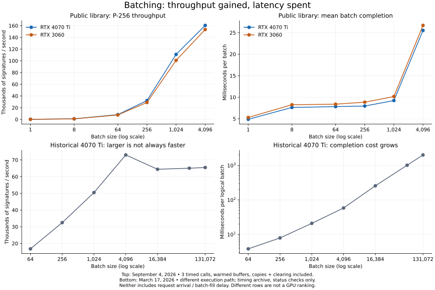

# Batch sizes, throughput and latency

Batching lets a caller share submission, transfer and synchronization costs across independent cryptographic operations and expose enough parallel work to occupy a GPU. The useful batch size depends on the primitive, payload, key grouping, host submission path, GPU and latency budget. More queued work eventually adds waiting without a corresponding throughput gain.

CPUs also benefit from batching and efficient native execution. The [CPU–GPU systems design](SYSTEMS_DESIGN.md) connects these measurements to CPU preparation, explicit CPU routing for small/urgent work, per-key fill time, device queues, verification and whole-system cost. The newer [native pipeline](PIPELINE_RESULTS.md) includes those in-process costs, with explicit qualification of its diagnostic captures.

**Version matters.** The following v0.1/v0.2 tables are preserved evidence. Version 0.3's [output-copy correction](DISPATCH_RESULTS.md) changes the large-batch curve. A batch of 4,096 can give high standalone signing throughput while a short online deadline requires smaller batches once filling and CPU verification are included. No universal per-card service sweet spot is established.

## Current table-backed signer

The [v0.2 comparison](P256_RESULTS.md) measures reference, comb and full-window execution with two runs per GPU and seven timed calls per cell. Full-window first exceeds the single-thread CPU baseline at sampled batch 64. Batch 256 is a useful mid-size starting point in these captures:

| GPU | Backend / batch | Signatures/s, range of two run means | Mean batch completion, range of two run means |
|---|---|---:|---:|
| RTX 4070 Ti | Full-window / 256 | 224,742–229,039 | 1.12–1.14 ms |
| RTX 3060 | Full-window / 256 | 177,810–194,276 | 1.32–1.44 ms |

At 1,024 and 4,096, results varied substantially between runs and the throughput peak changed. Both complete captures are published; neither card has an established universal optimum. The range above is across run means, not a latency percentile. Table/key import and batch formation are excluded; copying and clearing are included. See [the current chart and full sweep](P256_RESULTS.md).

## Initial reference and historical curves

The top panels measure the initial v0.1 public library on September 4, 2026. Version 0.2 adds [P-256 table backends](P256.md) with a separate comparison. The bottom panels show a different historical execution path on March 17. They illustrate two batching curves, not a comparison of implementations under identical conditions.

## Sampled starting points for the initial reference path

For P-256 signing, batch 1,024 is a useful starting point when batch completion around ten milliseconds is acceptable. It is the first sampled size to outperform the single-thread CPU reference on both cards. Batch 4,096 has the highest sampled GPU rate, at a higher completion cost:

| GPU | Profile | Batch | Signatures/s | Mean batch completion | Observed range, 3 calls |
|---|---|---:|---:|---:|---:|
| RTX 4070 Ti | First sampled CPU crossover | **1,024** | 110,956 | **9.23 ms** | 9.11–9.36 ms |
| RTX 4070 Ti | Highest sampled throughput | **4,096** | 160,455 | **25.53 ms** | 25.25–25.84 ms |
| RTX 3060 | First sampled CPU crossover | **1,024** | 100,741 | **10.16 ms** | 10.14–10.19 ms |
| RTX 3060 | Highest sampled throughput | **4,096** | 153,452 | **26.69 ms** | 26.15–27.76 ms |

Batch 1,024 provides about **69% / 66%** of the highest sampled throughput while taking **36% / 38%** of its mean batch time on the 4070 Ti / 3060. This is a measurable tradeoff, not a universal optimum. Batch 256 and below lost to the CPU reference; the exact crossover between 256 and 1,024 was not measured. The 4,096 result is at the public API's batch limit, so it does not prove hardware saturation. Three calls are not enough to establish p99 or a latency guarantee.

### Content size changes the choice

These are the highest-rate sampled CUDA cells at each displayed payload size. **The CPU reference was faster in every one.** Choosing the best GPU-only point is not evidence that GPU offload is the right choice for that workload.

| GPU | Operation | Payload / item | Best sampled batch | GPU MB/s | Mean batch completion |
|---|---|---:|---:|---:|---:|
| RTX 4070 Ti | AES-GCM seal | 1 KiB | 256 | 71.23 | 3.68 ms |
| RTX 3060 | AES-GCM seal | 1 KiB | 256 | 58.35 | 4.49 ms |
| RTX 4070 Ti | AES-GCM seal | 64 KiB | 256 | 105.35 | 159.26 ms |
| RTX 3060 | AES-GCM seal | 64 KiB | 256 | 78.28 | 214.33 ms |
| RTX 4070 Ti | SHA-256 | 1 KiB | 256 | 350.69 | 0.75 ms |
| RTX 3060 | SHA-256 | 1 KiB | 256 | 337.23 | 0.78 ms |
| RTX 4070 Ti | SHA-256 | 64 KiB | 256 | 1,121.45 | 14.96 ms |
| RTX 3060 | SHA-256 | 64 KiB | 256 | 845.96 | 19.83 ms |
| RTX 4070 Ti | AES-GCM seal | 1 MiB | 8 | 9.29 | 903.16 ms |
| RTX 3060 | AES-GCM seal | 1 MiB | 8 | 6.85 | 1,224.36 ms |
| RTX 4070 Ti | SHA-256 | 1 MiB | 8 | 297.36 | 28.21 ms |
| RTX 3060 | SHA-256 | 1 MiB | 8 | 206.15 | 40.69 ms |

At 1 MiB, only batches 1 and 8 among the default sampled sizes fit the harness's common working-data budget. The larger sampled sizes are recorded as unsupported; no optimum is inferred from a two-point comparison. At 1 KiB and 64 KiB, batch 256 is the largest sampled size, not proof of saturation. All rows include synchronous Python packing, copies, kernel execution, result materialization and clearing after warmup. MB/s uses decimal input bytes.

The [derived CSV](../benchmarks/batch_profiles.csv) contains exact rates, CPU ratios and observed ranges. [All raw samples](RESULTS.md) and [methodology](BENCHMARKS.md) are published.

## What the other cards establish

| Historical card/path | Useful observation | What is still unknown |
|---|---|---|
| A100, direct persistent engine | Batch 1,500 delivered 110,200 P-256 signs/s and 399,446 small-record AES seals/s in clean 30-second runs. | No batch/latency sweep in those captures; no established batch optimum. |
| L40S, scheduler | Pack 64 P-256: 13,362/s, p99 56.31 ms. Pack 1,500: 47,972/s, p99 214.24 ms. | Client count, pipeline and depth also changed; this is a configuration tradeoff, not isolated batch causality. |
| Historical RTX 4070 Ti, Python submit/poll | Batch 4,096 peaked at 73,001/s and 58.29 ms; larger logical batches slowed throughput and increased wall time. | Different implementation; status checks only, not independently verified signature throughput. |
| Experimental full-window RTX signer | Batch 1,500: 260,998/s on 4070 Ti; 120,150/s on 3060, with sampled oracle checks. | No latency distribution or batch sweep; not the current public signer. |

[Historical captures and context](HISTORICAL_BENCHMARKS.md) preserve the evidence behind these observations. A card name alone is insufficient to transfer tuning settings between implementations.

## Three different batching knobs

**Items per call** share API, packing and synchronization overhead. **GPU blocks and shards** determine how work is distributed within a particular engine. **Batches in flight** determine queue depth and how well the host overlaps submission and completion. A historical setting of 108 blocks / 108 shards is not a batch of 108 requests. A batch of 1,500 submitted to a persistent queue is not necessarily one 1,500-item CUDA launch. The new library exposes synchronous calls; it does not include the old persistent scheduler.

The goal is to keep enough work available without accumulating an unbounded queue. Stop increasing concurrency when throughput stops rising or latency exceeds the application's budget. Grouping by signing key can fragment traffic: the useful arrival rate is the rate for one compatible batch, not the site's aggregate traffic.

## Batch time is only part of request latency

For a request waiting on its result:

`total latency = batch-fill wait + queue wait + measured service/call time + transport/application overhead`

The reciprocal of signatures/s is amortized time per signature. It is **not** a request's latency in a parallel or pipelined system. The current library's batch-completion measurements exclude batch formation and service queueing. Historical scheduler percentiles include that scheduler's queueing but exclude collecting inputs and network transport.

An illustrative steady-arrival model makes the fill cost concrete. At compatible-key arrival rate `λ` and target batch `B`, with no timeout and a batch starting on its first arrival, the first item waits approximately `(B−1)/λ`; the average waits `(B−1)/(2λ)`. For B=1,024 at 100,000 arrivals/s, that is **10.23 ms first-item wait** and **5.12 ms average wait**, before execution. At 10,000/s, it is **102.3 ms** and **51.15 ms**. These are calculated examples, not observed benchmark latency; bursty arrivals and timers change them.

A practical caller needs both a size threshold and a maximum wait, plus bounded in-flight work. Measure the resulting full and partial batches, CPU alternatives, and p50/p95/p99 under the actual arrival process. This library currently provides the execution mechanism; it does not claim an automatic batching policy or an end-to-end service SLA.
