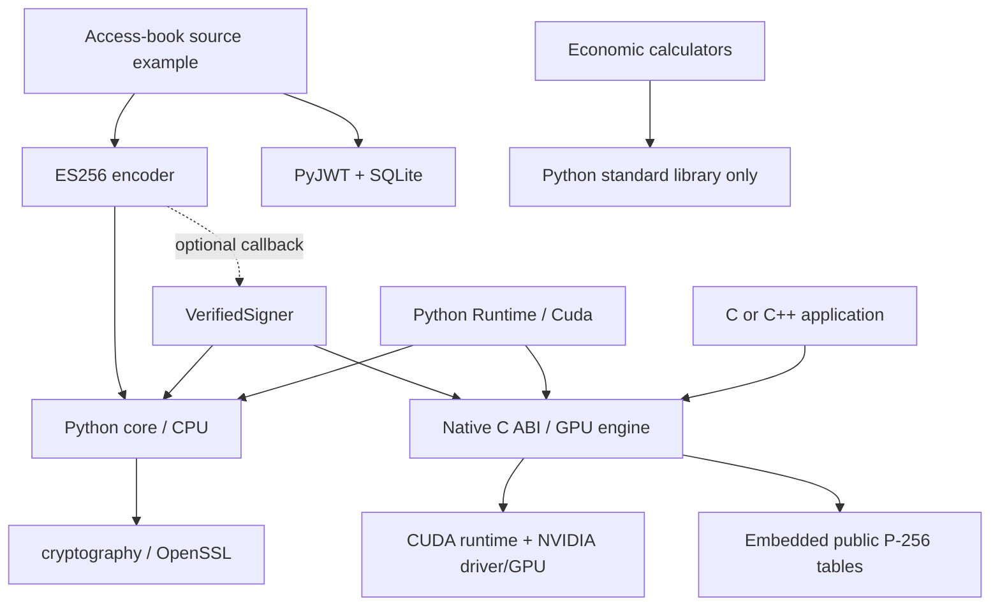

# Component catalog and adoption contracts

Use a capability through its public entry point without adopting the publisher
application. The native SDK, Python package, public data and evaluation tools
are distinct delivery units. [Runnable adoption paths](GETTING_STARTED.md)
show the smallest complete examples.

| Component | Delivery / entry point | Minimum dependencies | Maturity |
|---|---|---|---|
| [CPU cryptography](#cpu-cryptography) | Python wheel: `batchcrypto.Cpu` and helpers | Python 3.10+, cryptography 46–50 | Public preview API |
| [Native GPU engine and C ABI](#native-gpu-engine-and-c-abi) | Native SDK: `batchcrypto.h`, shared library, CMake target | Producer: CMake/C++/CUDA. Runtime: compatible NVIDIA GPU/driver/runtime | Public ABI 1, native v0.3 preview |
| [Guarded GPU signing](#guarded-gpu-signing) | Python wheel: `batchcrypto.verified.VerifiedSigner` | Python core + native SDK v0.3+ + GPU | Public preview guard |
| [ES256 construction](#es256-construction) | Python wheel: `batchcrypto.jws.sign_es256` | Python core + trusted signing callback | Public preview encoder |
| [Public P-256 tables](#public-p-256-tables) | `data/p256/` binaries + metadata + hashes | Reader implementing the documented format; generator uses cryptography | Public data format v1 |
| [Access books](#access-books) | Source example: `examples/access_book/engine.py` | Python core, PyJWT 2.13.0, SQLite | Experimental application profile |
| [Economic calculators](#economic-calculators) | Two standalone scripts in `benchmarks/` | Python standard library | Analysis tools; assumptions are inputs |
| [Benchmark harnesses](#benchmark-harnesses) | Source executables/scripts + raw captures | Depends on campaign; see below | Evaluation harnesses, not service APIs |

**Public preview** means a documented consumer interface with relevant tests.
It does not imply an independent security audit, production approval, support
SLA or a Python API stability promise across future preview releases. Native
consumers should check ABI/version requirements; applications should pin and
validate the release they adopt. Experimental application code has a narrower
evaluation purpose and is not installed by the core package.

## Dependency map

Arrows mean **uses**. The boxes for the publisher example and benchmarks are
optional consumers. The library does not depend on them.

Importing the Python package does not load a CUDA library. A `Cuda`, `Runtime`
or `VerifiedSigner` constructor loads the explicitly supplied native library.
Selecting CPU does not initialize GPU state. PyJWT is an optional `interop`
dependency used by token-consumer examples; the ES256 encoder itself does not
import it. The native library is one combined build; it has no per-algorithm
build switches. Calling only SHA-256 or P-256 is supported through that library.

## CPU cryptography

**Purpose.** Hash messages, perform authenticated encryption/decryption, generate
P-256 keys, sign digests and verify signatures on CPU. It supplies a baseline
and an explicit path for applications that do not need CUDA.

**Dependencies and installation.** `python -m pip install .` from a checkout,
or install the built Python wheel. The sole mandatory third-party dependency
is `cryptography>=46,<51`. The native SDK, CUDA, PyJWT and SQLite are not required.

**Interface and failure behavior.** [Python core](../python/batchcrypto/__init__.py):

| Entry point | Input → output |
|---|---|
| `Cpu.sha256(messages)` | Bounded iterable of byte strings → list of 32-byte digests |
| `Cpu.seal(key, records)` | 32-byte key + `Record(nonce, data, aad)` → ciphertext with appended 16-byte tag per record |
| `Cpu.open(key, records)` | Same framing with ciphertext/tag → plaintext or `None` for each failed authentication |
| `Cpu.sign(private_key, digests)` | 32-byte P-256 private scalar + 32-byte digests → 64-byte big-endian `r || s`, low-s, RFC6979 signatures |
| `generate_p256_key()` / `public_key(key)` | Fresh OS-backed scalar / 65-byte uncompressed public point |
| `verify_p256(public, digest, signature)` | Encoded public point, digest and raw signature → boolean validation result |

Batch limit: 4,096 items. Payload limit: 1 MiB/item; AES AAD limit: 64 KiB/item.
Hash/AES working data are bounded at 64 MiB per call; AES nonces are 12 bytes.
Invalid shapes or keys fail validation. There is no partial list returned from
a failed signing call. AES tag failures are represented per item. Signature
verification accepts either valid s form; signing emits low-s.

**Application ownership.** Persistent keys, nonce uniqueness for the full AES
key lifetime, key rotation, identity, authorization, replay prevention and the
meaning of input data. A verified signature is not a paid-access decision.

**Smallest complete example.** [cpu_only.py](../examples/cpu_only.py), including
an altered-tag check. **Evidence:** [test_crypto.py](../tests/test_crypto.py),
the CPU paths in [initial primitive results](RESULTS.md), and the installed-wheel
check [check_python_install.py](../tools/check_python_install.py). Performance
from a different multi-worker native harness does not describe this Python API.
**Maturity:** public preview API backed by standard CPU cryptography.

## Native GPU engine and C ABI

**Purpose.** Execute batches of AES-256-GCM, SHA-256 and P-256 signing/public-key
operations with reusable GPU buffers, streams and key slots.

**Dependencies and installation.** Build with CMake 3.24+, compatible C++17/CUDA
toolchains and the CUDA toolkit, then install the SDK. A C/C++ consumer uses
`find_package(batchcrypto 0.3 CONFIG REQUIRED)` and
`target_link_libraries(... PRIVATE batchcrypto::batchcrypto)`. No Python,
PyTorch or OpenSSL is required by the native library. Execution requires the
compatible driver/GPU, CUDA runtime and platform runtime libraries. See the
[installed consumer path](GETTING_STARTED.md#use-the-installed-c-abi).

**Interface and failure behavior.** [batchcrypto.h](../include/batchcrypto.h)
is the authoritative ABI contract. Context calls use host buffers and execute
synchronously. `bc_create`/`bc_destroy` own a runtime;
`bc_key_put`/`bc_key_remove` update its 16 key slots using expected epochs;
`bc_hash`, `bc_seal_at_epoch`, `bc_open_at_epoch`, `bc_sign_at_epoch` and
`bc_export_public_key` operate on that runtime. Stateless convenience calls
are also available. Maximum batch and byte bounds are in the header.

Check both the call result and every item's status. A call-level failure
invalidates the entire output. An authenticated-decryption item failure returns
`BC_AUTH_FAILED` and zeroed output. An epoch conflict leaves outputs untouched
and reports zero submitted/completed items; discard those outputs. Native
failures never select CPU. Pointers must be valid, adequately sized and
non-overlapping. One context serializes calls; distinct contexts own separate
state. Finish/join caller work before destruction.

**Application ownership.** Authorization before invoking primitives, unique
AES nonces across processes/restarts, trusted key import/rotation, CPU signature
verification where required, batch formation, deadlines, scheduling, retries and
accounting. Epoch checks protect local key-generation selection, not distributed
key management. Secret-dependent execution and host/device key residency remain
documented limitations.

**Smallest complete example.** [native_consumer](../examples/native_consumer)
hashes a known input using only the installed SDK. The broader
[c_api.c](../examples/c_api.c) checks operation and key-lifecycle behavior.
**Evidence:** [validation record](VALIDATION.md), CUDA-enabled
[test_crypto.py](../tests/test_crypto.py), [table tests](../tests/test_p256_tables.py),
[dispatch results](DISPATCH_RESULTS.md) and [pipeline results](PIPELINE_RESULTS.md).
Primitive results exclude application authorization/accounting; historical A100
figures describe an earlier engine. **Maturity:** public ABI 1, native v0.3
technical preview, not independently audited.

The [ABI implementation](../src/abi/batchcrypto_abi.cpp),
[execution engine](../src/engine/crypto_engine.cu),
[runtime](../src/engine/runtime.hpp) and [kernels](../src/kernels/crypto_kernels.cuh)
are implementation layers of this single component. Individual `.cu` or `.cuh`
files are not self-contained consumer packages; use the C ABI to avoid depending
on internal layouts.

## Guarded GPU signing

**Purpose.** Bind a GPU signing operation to an exact key epoch and independently
verify every output against a CPU-derived public-key pin before releasing it.

**Dependencies and installation.** Base Python wheel plus native v0.3+ library
and compatible GPU/runtime. No PyJWT or application ledger dependency.

**Interface and failure behavior.**
[`VerifiedSigner(library, device=0)`](../python/batchcrypto/verified.py) is an
owned context manager. `load_key(slot, key, expected_epoch=...)` returns the
new epoch; `sign(slot, digests, expected_epoch=epoch)` returns the complete list
of independently verified raw signatures; `retire_key` advances the epoch and
removes the key. Input/lifecycle errors reject the request. Backend faults,
wrong public keys, malformed/reordered/corrupt output or inconsistent reports
raise `VerificationError` and close/quarantine the signer. Diagnose the failure
before creating another instance; the example does not silently retry elsewhere.

**Application ownership.** Key trust/lifecycle, safe runtime ownership, request
authorization, business retries, cost of verification and fault recovery.
This wrapper validates output correctness; it does not prevent key leakage or
provide an HSM/secure-erasure guarantee. Keep its runtime private.

**Smallest complete example.** [gpu_signing.py](../examples/gpu_signing.py).
**Evidence:** [test_verified.py](../tests/test_verified.py),
[production-security boundary](PRODUCTION_READINESS.md), and
[separate verification cost control](VERIFICATION_CONTROL_RESULTS.md). The GPU
primitive peak does not include this guard's CPU cost. **Maturity:** public
preview guard with explicit fault tests and limited local GPU validation.

## ES256 construction

**Purpose.** Construct standard compact ES256 JWS values from exact payload
bytes using a caller-supplied P-256 signing callback.

**Dependencies and installation.** Python core only for construction.
`python -m pip install '.[interop]'` adds PyJWT 2.13.0 for the independent consumer
example. A GPU callback additionally uses `VerifiedSigner`; CPU callbacks need
no native library. This module is inside the Python wheel, not a separate wheel.

**Interface and failure behavior.**
[`sign_es256(payloads, key_id=..., sign_digests=...)`](../python/batchcrypto/jws.py)
passes SHA-256 signing-input digests to the trusted callback and returns compact
token strings. The protected algorithm is fixed to ES256. `key_id` is trusted
configuration, 1–128 printable ASCII characters. Payload bytes are preserved;
batch/payload/aggregate bounds come from the Python core. The callback must
return exactly one valid-length, valid-range, low-s raw signature per input.
Invalid inputs/outputs fail before a result list is released; callback exceptions
propagate. The encoder's shape checks do not independently authenticate callback
output. GPU callbacks should use the guarded signer.

**Application ownership.** Trusted signer/key selection, epoch policy, payload
schema, canonicalization if required, pinned consumer algorithms/keys, issuer,
audience, lifetime, scope and replay/accounting rules. This is an encoder, not a
JWT parser, payment protocol, HTTP signature adapter or general signing endpoint.

**Smallest complete example.** [jws_grant.py](../examples/jws_grant.py), CPU by
default and independently verified by PyJWT. **Evidence:**
[test_jws.py](../tests/test_jws.py), [compatibility note](COMPATIBILITY.md),
[ready-wave native service](READY_WAVE_RESULTS.md). The native ready-wave harness
uses its own encoding code and measures a different path from this Python module.
**Maturity:** public preview encoder, with interoperability evidence for the
specified ES256 profile.

## Public P-256 tables

**Purpose.** Supply public multiples of generator G for comb/full-window
fixed-base P-256 multiplication, with reproducible generation and verification.

**Dependencies and installation.** Copy the matching binary, JSON layout and
SHA-256 fingerprint from [data/p256](../data/p256). The native build embeds these
files; a runtime does not need filesystem lookup. The Python wheel does not
contain them. Regeneration uses Python/cryptography, the
[generator](../tools/generate_p256_tables.py) and its attributed
[math helper](../tools/imported/p256_table_math.py).

**Interface and failure behavior.** Format `GBCTBL01`, version 1, typed 32-byte
header and 64-byte point entries. The comb file has 255 points; full-window has
4,224 points across 33 windows, including carry. Coordinates use the documented
little-endian Montgomery representation. Read the [full layout](P256.md) before
porting; treating these as ordinary encoded public keys is incorrect. The build
checks fingerprints; `--check` regenerates and independently checks every point,
failing on differences. These data contain no private keys or nonces.

**Application ownership.** Correct table interpretation, matching multiplication
algorithm, constant-time/key-exposure requirements and independent validation
when adapting the arithmetic. A public table is not a standalone signer.

**Smallest check.** `python tools/generate_p256_tables.py --check`.
**Evidence:** [metadata/fingerprints](../data/p256/README.md),
[test_p256_tables.py](../tests/test_p256_tables.py), [validation](VALIDATION.md).
**Maturity:** documented public format v1; arithmetic/backend security limitations
remain independent of data integrity.

## Access books

**Purpose.** Evaluate scoped prepaid permissions, one-time resource redemption,
budget conservation, cancellation and durable receipt recovery.

**Dependencies and installation.** Keep the original source example
[`examples/access_book/`](../examples/access_book) and install the core with its
`interop` extra. Dependencies are the core, PyJWT 2.13.0 and standard SQLite.
It is not included in the core wheel and does not require CUDA. Its CPU `Authority`
does not automatically substitute a GPU issuer.

**Interface and failure behavior.** `Offer` defines the trusted catalog entry;
`Authority` signs and pins verification; `Clearing` owns one SQLite connection.
`issue` → `(book_id, token)`; `activate` → admitted book ID; `redeem` → immutable
receipt; `release` → unused units released; `purchase` → book/token/receipt under
one commit; `audit` → reconciled account/publisher totals. `Denied` rejects
invalid policy or conflicting retries without a debit. Signing/SQL failures
roll back the transaction; unexpected failures propagate. Reuse the exact retry
identity for recovery. Use one connection per caller/thread and close it.

**Application ownership.** Authenticated identities, trusted catalog and time,
funded principal, live fee accounts, expiry scheduling, delivery policy, key
rotation, shared authoritative spending state, storage retention and payout
reconciliation. Seeding balances is a synthetic fixture operation. Database
receipts are not proof of delivery or cash settlement. See the
[complete accounting/failure contract](ACCESS_BOOK_DESIGN.md).

**Smallest complete example.** [access_book_demo.py](../examples/access_book_demo.py).
**Evidence:** [test_access_book.py](../tests/test_access_book.py) and
[35,840 reconciled local redemptions](ACCESS_BOOK_RESULTS.md), including the
optimized atomic CPU comparison and cancellation. **Maturity:** experimental
application profile with simulated funds; no payment/network service or
production ledger certification.

## Economic calculators

**Purpose.** Convert explicit measured rates and cost assumptions into unit
costs, contribution and break-even conditions.

**Dependencies and installation.** Copy either script as a standalone file;
Python standard library only. No package install, CUDA, account credentials,
network service or actual money is involved.

**Interface and failure behavior.**
[`economics.py`](../benchmarks/economics.py) provides `per_million`, `owned_hourly`
and a CLI taking hourly cost, rate, scope and optional utilization/bill lifetime.
[`access_business_model.py`](../benchmarks/access_business_model.py) provides
`Assumptions`, `evaluate` and a CLI taking `--rate` plus optional JSON assumptions.
Both return/print scenario data; invalid numeric inputs raise validation errors
or cause a nonzero CLI exit. No automatic provider prices or provisioning.

**Application ownership.** Matched actual invoices, total cost allocation,
correct timing denominator, realistic utilization, payment/payout/risk terms,
publisher share, liabilities and fixed operating cost. A modeled positive
contribution is not measured revenue or proof of buyer demand.

**Smallest examples.** [Analysis tool commands](GETTING_STARTED.md#use-data-and-analysis-tools).
**Evidence:** [test_economics.py](../tests/test_economics.py),
[test_access_business.py](../tests/test_access_business.py),
[cost inventory](ECONOMICS.md) and [access scenarios](ACCESS_BOOK_RESULTS.md).
**Maturity:** transparent analysis tools with input-validation/accounting tests.

## Benchmark harnesses

**Purpose.** Reproduce specific primitive, queued, ready-wave or accounting
experiments and verify their archived provenance. They are separate from the
application-facing library APIs.

**Dependencies and entry points.** Python GPU campaigns use the Python package,
native SDK/GPU and `nvidia-smi`; full Git history is needed for archived source
verification. [Native pipeline/ready-wave](../benchmarks/native/CMakeLists.txt)
builds need CMake, C++17, threads and OpenSSL 3.2+; `BC_LIBRARY` optionally enables
the GPU path. The [access-book campaign](../benchmarks/run_access_book.py) uses
the experimental example and its Python/SQLite dependencies. Report/verifier
scripts also depend on their local helpers and captures; they are not all
standalone files like the two economic calculators.

**Failure behavior and ownership.** Captures record the scope, environment,
source/binary hashes, work counts and timing boundary. Campaigns can require a
clean committed checkout and reject overwriting evidence. Keep failed/partial
captures and investigate; a passing arithmetic/provenance verifier does not
establish a production SLO or physical security. The evaluator owns workload
fit, device selection, system isolation and cost assumptions.

**Evidence and commands.** [Benchmark method](BENCHMARKS.md),
[pipeline reproduction](PIPELINE_RESULTS.md), [ready-wave campaign](../benchmarks/READY_WAVE_CAMPAIGN.md),
[access-book campaign](../benchmarks/ACCESS_BOOK_CAMPAIGN.md) and its
[atomic control](../benchmarks/ACCESS_BOOK_ATOMIC_CONTROL.md). Use each campaign's
documented setup and denominator. **Maturity:** reproducible evaluation harnesses;
no shared automatic scheduler, deployment service or performance SLA.

## Distribution and maintenance boundaries

The source repository and source ZIP carry the library, examples, public data,
docs, tests and evidence. The wheel carries only the `batchcrypto` package and
distribution metadata. The native SDK carries the public C interface/library
and CMake package. The standard entry points above avoid importing internal
underscore helpers or copying private engine headers into an application.

Apache-2.0 source and selected-source notices are in [LICENSE](../LICENSE) and
[NOTICE](../NOTICE); [EXTRACTION.json](../EXTRACTION.json) records provenance.
Dependency licensing is separate. Report bugs through repository issues and
security concerns using [SECURITY.md](../SECURITY.md). No separate support or
long-term maintenance agreement is implied by an example or benchmark.

For a funding/access business evaluation, use the [pilot brief](PILOT_BRIEF.md)
to identify a buyer, compare simpler alternatives and measure both parties'
benefit before treating a technical result as a commercial conclusion.
