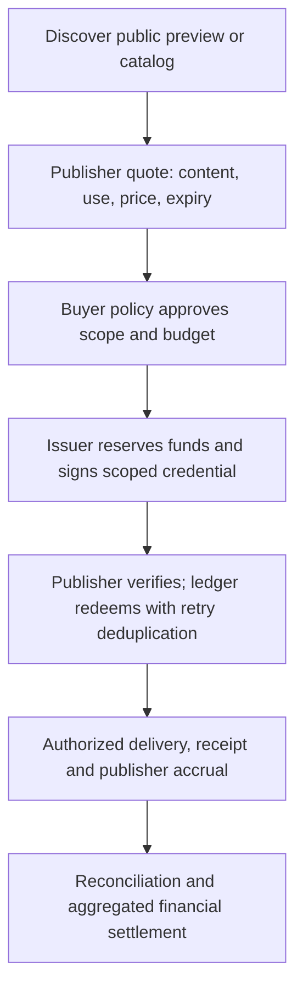

# Keys instead of clicks: a thesis for paid machine access

**Thesis:** When an AI system consumes useful publisher content without sending
a person to the publisher's website, the publisher can earn revenue through
an authorized access transaction. A signed, scoped access credential connects
an approved buyer budget to content delivery and an auditable publisher credit.
CPU–GPU batching may reduce the cryptographic cost of serving those transactions
when enough compatible work is ready within the latency budget.

This is a proposed application and a testable business hypothesis around the
[public cryptographic engine](../README.md). The repository supplies working
cryptography and measurements. Buyer demand, publisher revenue, payment
settlement and a production access service remain to be demonstrated.

The hypothesis now has a runnable [funded-access example](ACCESS_BOOK_DESIGN.md):
one signed book can cover exact resources, while atomic per-resource redemptions
connect reserved buyer units to publisher receivables. Small or uncertain work
can use a single-commit CPU purchase. [Measured accounting and costs](ACCESS_BOOK_RESULTS.md)
include cancellation, a stronger co-located CPU baseline and editable economic
thresholds. The example uses simulated funds; it makes no payment or adoption claim.

## The problem and the intended customer

An answer can be valuable to an AI user even when that user never visits the
sources. Publishers whose business depends on referrals then need another way
to participate in that value. The candidate customers are publishers with
content buyers need, AI services willing to pay for permitted access, and
infrastructure providers that can connect them at an acceptable cost.

The initial case should be narrow: one willing publisher, a rights-cleared
corpus, one buyer and a defined use such as retrieval for answering questions.
Freshness, specialist coverage or otherwise unavailable material must make
the paid content useful enough to justify its price. Useful free content,
subscriptions and negotiated licenses remain alternatives. A publisher may
also choose free machine access. A universal toll on the web is unnecessary
for this hypothesis to succeed.

In the maintainer-provided Big Technology Podcast transcript, Matthew Prince
discusses the weakening referral bargain and the need for smaller publishers
to offer machine access on workable commercial terms. That is our reading of
the discussion, rather than a claim that he endorsed this project. Cloudflare's
[July 2026 announcement](https://www.cloudflare.com/press/press-releases/2026/cloudflare-allows-the-agentic-internet-to-flourish-with-a-simple-philosophy-your-content-your-rules/)
independently describes publisher choice, efficient AI access and compensation.
Its [Pay per crawl documentation](https://developers.cloudflare.com/ai-crawl-control/features/pay-per-crawl/what-is-pay-per-crawl/)
already describes priced requests and a merchant-of-record role. These are
evidence that this industry problem is being addressed; they do not validate
our implementation or establish that GPUs are required. The podcast's traffic
forecasts are not inputs to our capacity or revenue claims.

## What the key represents

Here, an **access key** means a signed credential representing permission to
consume specified content under agreed terms, backed by an account or payment
arrangement the publisher accepts. Its monetary backing comes from that
arrangement. Generating a cryptographic key or spending electricity creates
no publisher credit by itself.

| Object | Role |
|---|---|
| Signing key pair | Establishes who signed a credential; held and rotated by the issuer under its security policy |
| Access credential | Carries a scoped entitlement, quote reference, expiry and redemption identity; its bearer or recipient rules must be explicit |
| Content encryption key | Optionally protects content bytes; delivered only through an authorized key-release mechanism |
| Buyer account and publisher ledger | Record available funds, reservations, charges, reversals and amounts owed |
| Receipt | Authenticates the recorded transaction and content commitments; supports accounting and disputes |

A prepaid "key book" can therefore mean a budget or collection of entitlements.
It need not mean a fresh private key for every page. A proof-of-work challenge
can impose access friction, but contributes no payment unless a separate
economic arrangement actually transfers value to the publisher.

## A complete candidate transaction

The following flow is a reference design, not an implemented payment API:

1. **Discover and quote.** The publisher identifies the content or bundle,
   version, permitted use, price and expiry. The issuer obtains an authoritative
   quote. A client-supplied price alone cannot authorize a charge or discount.
2. **Approve and issue.** Deterministic buyer policy authorizes the purchase
   within a budget. The account service reserves the agreed amount before
   issuing a credential bound to that quote and the accepted issuer identity.
3. **Verify and redeem.** The publisher checks the signature, trusted issuer,
   audience, scope, expiry and any required buyer proof. The ledger atomically
   records redemption and the monetary effect using a stable transaction ID.
   A valid signature alone cannot detect that a credential was already spent.
4. **Deliver and record.** The service makes the authorized content available
   and produces a receipt tied to the transaction and content version. A retry
   recovers the same transaction rather than charging again. The protocol must
   define recovery or reversal if redemption succeeds but delivery fails.
5. **Reconcile and settle.** Publisher accrual is an amount owed. Payment rails
   later discharge that obligation under the commercial agreement, with
   explicit fees, payout timing and dispute handling.

This design seeks one monetary effect per accepted redemption, with recoverable
delivery. It cannot make database commits, network delivery and bank settlement
one atomic action. A signed receipt establishes what its issuer attests; it
does not prove the buyer read the content, used it in an answer, or received
a bank payout.

The publisher must control the protected delivery path and possess the rights
it offers. Ordinary authenticated HTTPS may be sufficient. Content encryption
is optional and cannot revoke plaintext already received. A retrieval license
also does not automatically grant model-training or redistribution rights.

## Three distinct opportunities to batch

| Layer | What is grouped | Potential benefit | Constraint |
|---|---|---|---|
| Funding and settlement | Many small access charges funded or paid out together | Amortizes payment-rail fees | Requires a trustworthy ledger, accepted credit exposure and payout agreement |
| Access protocol | A known content bundle or reusable entitlement | Reduces quotes, round trips and repeated work | Publisher permissions, freshness and scope still apply |
| Cryptographic execution | Independent signatures under compatible algorithm, signer, epoch and trust policy | Amortizes GPU submission and exposes parallel work | Must beat a tuned CPU path including preparation, queues, verification and device cost |

These savings must be measured separately. A bundle may need one signature for
many resources. A cached entitlement may need no new signature. Counting tool
calls, paid accesses or websites does not reveal the number of fresh signing
operations, and revenue accounting does not belong in a CUDA kernel.

An agent can fund a budget before it knows every destination and can prepare
credentials as the required quotes and other inputs become known. Independent
planning can overlap that preparation. Unknown prices, content identifiers or
server challenges prevent completing the corresponding credential early.
Preparation must not silently authorize speculative purchases. The
[agent access design](AGENT_ACCESS_DESIGN.md) describes these dependencies.

The heterogeneous design keeps policy, accounts, queues and response handling
on CPU. Small or urgent cryptographic jobs also stay on CPU. A permitted issuer
may accumulate enough compatible signing work from many buyers for a GPU
batch, even if each buyer visits only a few sites. Independent publisher keys
fragment that work; pooling authority requires explicit delegation. Both CPU
and GPU comparisons must receive the same caching, bundling and preparation
opportunities. [System design and latency accounting](SYSTEMS_DESIGN.md).

## Protocol fit comes before acceleration

This release signs **P-256 ECDSA**; it has no Ed25519 GPU implementation.
Cloudflare's [2025 Pay per crawl announcement](https://blog.cloudflare.com/introducing-pay-per-crawl/)
describes **Ed25519** crawler keys and HTTP Message Signatures. Consequently,
our P-256 benchmarks do not measure that authentication path, and this library
is not a drop-in Pay per crawl implementation.

A publisher grant or receipt is a different object from a crawler's request
signature. It could use P-256 if all participants explicitly accept that
versioned protocol and its security model. Alternatively, an integration may
require another backend. Choose and validate the actual wire protocol first;
never substitute algorithms implicitly or extrapolate P-256 throughput to
Ed25519. The public [content-grant example](MACHINE_AUTHORIZED_CONTENT.md)
demonstrates bindings using its own encoding, without implementing accounts,
payment, request authentication or key release.

The [ES256 JWS integration](COMPATIBILITY.md) now demonstrates one standard format using actual GPU signatures accepted by PyJWT. It supplies a concrete option for participants that accept ES256; it does not convert an Ed25519 credential or change an existing publisher contract.

## What would establish or disprove the thesis?

| Hypothesis | Required evidence | Result that weakens or rejects it |
|---|---|---|
| Buyers value licensed access | Compare free-only and licensed retrieval on the same tasks and model; use blinded quality assessment, an agreed spend cap and later repeat purchases | Paid material does not improve useful outcomes enough to justify its cost, or buyers do not return |
| Publishers can earn sustainable revenue | Track reconciled receipts and actual payouts, fees, delivery costs, support/disputes and the cost of maintaining the content | Gross access revenue fails to cover the relevant costs or does not reach publishers |
| Credentials make access accountable | A bounded prototype preserves balances and one charge per redemption across retries, concurrency, expiry, issuer rotation and interrupted delivery | Funds can be created, double-spent, stranded without recovery, or redeemed outside the purchased scope |
| GPU batching improves the serving economics | Use the agreed algorithm, realistic key distribution and arrival/dependency traces; compare CPU and hybrid cost per correctly completed request within the same deadline and security policy | CPU meets the goal more cheaply, batches miss deadlines, verification dominates, or the permitted key boundary excludes the GPU |

The business and acceleration hypotheses can have different outcomes. Paid
machine access could work economically with a CPU-only service. GPU signing
could help another application even if this particular content market fails.

For the buyer, report total spend and task quality alongside **cost per
successfully resolved question**, with unresolved questions visible. For the
publisher, report net proceeds per 1,000 resolved questions alongside paid
access counts, refunds and actual payouts. Resolution is an evaluation metric;
the proposed charge is for agreed access, not an unverified claim about how an
AI answer used a source. For the operator, include payment fees, ledger and
identity services, storage/egress, CPU, GPU, idle capacity and operations. The
[existing economics model](ECONOMICS.md) covers compute scenarios, not all of
these business costs.

## Evidence today and the minimum next experiment

The [ES256 interoperability demonstration](COMPATIBILITY.md) and
[ready-wave measurements](READY_WAVE_RESULTS.md) now provide concrete evidence
for the protocol-format and batching questions. A 1,024-token one-check wave
had a narrow 1.052× conservative hybrid/CPU ratio; the
[issuer-plus-consumer control](VERIFICATION_CONTROL_RESULTS.md) favored CPU at
both tested sizes. The funded-access proposition can therefore be evaluated
with a CPU-first service while keeping GPU acceleration optional and tied to
the measured verification contract. Neither result establishes buyer demand
or publisher payouts.

The engine, ABI, Python bindings, public P-256 tables and
[published GPU measurements](../README.md#measured-evidence) are inspectable
today. The [native pipeline](PIPELINE_RESULTS.md) includes preparation, queueing
and independent verification. The [RTX 3060 follow-up](RTX3060_PIPELINE.md)
has not established a repeatable hybrid advantage under its tested deadline
and quality criteria. None of those measurements demonstrates paid content
demand, settlement throughput or publisher revenue. Key residency and
secret-dependent GPU execution also remain [security constraints](PRODUCTION_READINESS.md).

The next experiment should be a separate, bounded application harness around
the library, keeping the reusable public engine generic:

1. **Protocol and accounting:** use synthetic content and simulated balances
   to exercise quote, issuance, redemption, retry, delivery and reconciliation.
   Record the exact supported algorithm and trust inputs. Establish correctness
   on CPU before timing an optional GPU path.
2. **Buyer and publisher value:** with the necessary rights and participant
   approval, compare a defined licensed corpus with the free-only alternative.
   Agree success criteria before collecting results. Simulated credit cannot
   establish willingness to pay; actual purchases and payouts require a
   separate authorized pilot with a payment provider.
3. **Serving economics:** replay the same realistic workloads through tuned
   CPU and hybrid implementations, including compatible batch sizes, deadlines,
   all required checks and full allocated costs. Retain negative results.

These are planned evaluations, not shipped capabilities. A credible adoption
decision needs a buyer who benefits, a publisher who gets paid, accountable
access and acceptable security. GPU acceleration earns its place only if it
improves that measured system.
