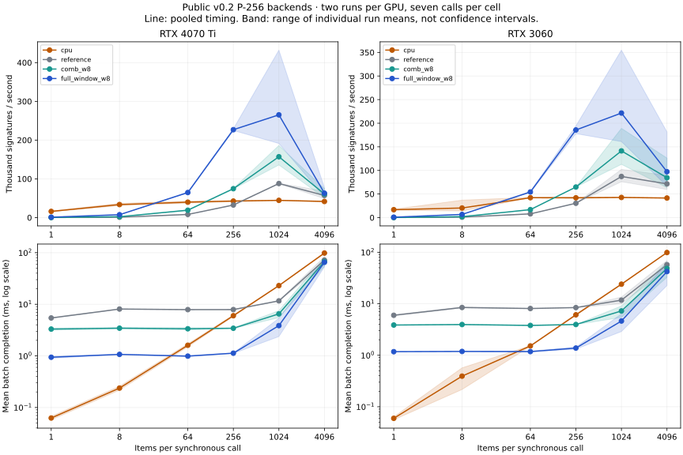

# Public P-256 backend measurements — September 4, 2026

The v0.2 comb and full-window paths are exercised through the same public runtime and C ABI as the reference signer. Full-window signing wins against the stated single-thread CPU baseline from sampled batch 64 on both cards in both runs. Batch 256 offers the most consistent mid-size tradeoff in these captures; larger batches show substantial variability and do not establish a reliable optimum.



Lines combine the two runs' measured time; shaded bands span their individual run means. Bands are not confidence intervals or within-run latency percentiles. Every row remains available separately in the [derived CSV](../benchmarks/p256_profiles.csv) and raw captures below.

## A practical starting point: batch 256

Ranges below span the two run means, with seven timed calls in each run. Throughput and latency are linked: the faster run has the lower mean completion time.

| GPU | Backend | Signatures/s, range of run means | Mean batch completion, range of run means |
|---|---|---:|---:|
| RTX 4070 Ti | CPU/OpenSSL | 41,218–44,130 | 5.80–6.21 ms |
| RTX 4070 Ti | Reference | 32,082–32,795 | 7.81–7.98 ms |
| RTX 4070 Ti | Comb w8 | 73,851–75,363 | 3.40–3.47 ms |
| RTX 4070 Ti | **Full-window w8** | **224,742–229,039** | **1.12–1.14 ms** |
| RTX 3060 | CPU/OpenSSL | 40,689–43,358 | 5.90–6.29 ms |
| RTX 3060 | Reference | 30,356–30,423 | 8.41–8.43 ms |
| RTX 3060 | Comb w8 | 64,616–64,880 | 3.95–3.96 ms |
| RTX 3060 | **Full-window w8** | **177,810–194,276** | **1.32–1.44 ms** |

This is a sampled starting point for evaluation, not a card-wide sweet spot or service guarantee. It excludes collecting 256 compatible requests, key/table import and application queueing. One key is used per batch. Different key distributions, arrival rates, hosts and scheduling can change the choice.

## Full-window batch sweep, preserving both runs

Values are `run 1 / run 2`; each rate counts signatures of 32-byte digests. See the CSV for all reference, comb and CPU rows and each call's observed minimum/maximum.

| GPU | Batch | Signatures/s, run 1 / run 2 | Mean batch completion ms, run 1 / run 2 |
|---|---:|---:|---:|
| RTX 4070 Ti | 64 | 63,528 / 65,880 | 1.01 / 0.97 |
| RTX 4070 Ti | 256 | 229,039 / 224,742 | 1.12 / 1.14 |
| RTX 4070 Ti | 1,024 | 191,293 / 432,075 | 5.35 / 2.37 |
| RTX 4070 Ti | 4,096 | 53,151 / 77,346 | 77.06 / 52.96 |
| RTX 3060 | 64 | 53,129 / 55,540 | 1.21 / 1.15 |
| RTX 3060 | 256 | 177,810 / 194,276 | 1.44 / 1.32 |
| RTX 3060 | 1,024 | 161,066 / 354,743 | 6.36 / 2.89 |
| RTX 3060 | 4,096 | 181,559 / 66,364 | 22.56 / 61.72 |

Batches 1 and 8 remain slower than CPU in all four captures. At 64, full-window first exceeds CPU in the sampled sweep; the exact crossover between 8 and 64 is unmeasured. Comb first exceeds CPU at sampled batch 256; reference first does so at 1,024.

The highest sampled rate changes between runs: 4070 Ti peaks at 256 then 1,024; 3060 peaks at 4,096 then 1,024. Large-batch slowdowns also appear in the reference and comb paths. The cause has not been isolated, and these were local Windows runs without a controlled exclusive-load environment. The 432K/s and 355K/s observations are recorded, but are not sustained-performance claims. The v0.2 reference's large-batch measurements also differ from the [initial v0.1 matrix](RESULTS.md); this change is not evidence of a universal performance improvement across all sizes.

Before deployment tuning, measure longer runs under controlled load, use repeated keys and independent key sets, attribute time to host work, copying, GPU execution and clearing, and include the actual batch-fill policy. A native multi-core CPU comparison and p50/p95/p99 request latency remain outstanding. See [batch formation and latency](BATCHING.md).

## Captures and provenance

| GPU | First run | Repeat run | Rows per run |
|---|---|---|---:|
| RTX 4070 Ti | [JSON](../benchmarks/p256_results/rtx4070ti-2026-09-04.json) | [JSON](../benchmarks/p256_results/rtx4070ti-repeat-2026-09-04.json) | 24 |
| RTX 3060 | [JSON](../benchmarks/p256_results/rtx3060-2026-09-04.json) | [JSON](../benchmarks/p256_results/rtx3060-repeat-2026-09-04.json) | 24 |

All four runs measured source commit `000e531` (the full commit is in each JSON), native `0.2.0-preview`, CUDA 13.0.88, MSVC 19.44.35217, Release, architectures 86 and 89, driver 610.62, Ryzen 7 7800X3D, Python 3.12.14, cryptography 50.0.1 and OpenSSL 4.0.2. Source and native binary hashes are recorded per capture. The original architecture arrays are empty because the harness missed CMake's `UNINITIALIZED` cache type; the [build supplement](../benchmarks/p256_build.txt) records the cache value and the actual binary's sm_86/sm_89 code objects. The raw captures are unchanged and the harness is corrected. Both cards use the same host and binary; runs execute sequentially. Each run generates a fresh key, shared by CPU and all GPU backends within that run.

Each backend/batch pair has a separate runtime, key/table import and one warmup before seven measured calls. Timing order rotates between CPU, reference, comb and full-window. The CPU uses a cached OpenSSL key on one Python thread. Timing includes synchronous Python input packing, host/device copies, CUDA execution, result construction and buffer clearing. All signatures are compared byte-for-byte with deterministic low-s OpenSSL output outside timing. Every GPU report and completion counter is checked. Across four captures, 457,716 timed GPU signatures and 65,388 warmup GPU signatures passed; call/item errors were zero.

```sh
python benchmarks/verify_p256_results.py
python benchmarks/report_p256.py --check
```

The verifier checks [published fingerprints](../benchmarks/p256_results/SHA256SUMS), measured-source hashes against Git history, complete sweeps, timing arithmetic and accounting. It does not rerun or independently attest the measurements. The report tool regenerates the CSV; add `--plot` with matplotlib installed to regenerate the chart. See [backend reproduction](P256.md) and [overall methodology](BENCHMARKS.md).

The [A100 and earlier full-window results](HISTORICAL_BENCHMARKS.md) use different executors. The public v0.2 library has not been benchmarked on A100 or L40S. These P-256 results do not establish new AES-GCM or SHA-256 throughput, nor side-channel resistance.
