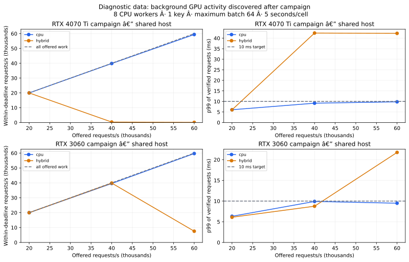

# Native CPU/GPU pipeline: latency, verification and economics

**The first three captures are diagnostic, not an uncontended capacity comparison.** After this campaign finished, the RTX 4070 Ti remained 96% busy with no benchmark process running. No quiet-host gate or continuous telemetry was present in those captures, and both cards share the CPU host. The exact overlap with each earlier cell is unknown. Consequently these records must not establish a GPU ranking, maximum capacity or cost advantage. [Recorded conditions](../benchmarks/pipeline_conditions.json).

They still provide an executable request pipeline, independent verification of every completed signature and inspectable overload/latency accounting. A new harness preflight checks all GPUs for three observations at or below 5% utilization and refuses to start otherwise, unless the operator explicitly selects diagnostic contention. It records per-second GPU utilization, memory, clocks, temperature and power. Quiet preflight is a useful control, not proof of an exclusive host or a measurement of wall-system energy.

## What is timed

The [native C++ harness](../benchmarks/native/pipeline.cpp) uses OpenSSL directly, with 1, 4 or 8 CPU worker threads. Keys and per-worker sign/verify contexts are cached. Signing uses OpenSSL's deterministic ECDSA mode, SHA-256 and low-s normalization; the independent verifier holds public-only keys. The GPU uses the same ephemeral keys, full-window backend and `bc_sign_at_epoch`. Every key's warm-up outputs must match OpenSSL exactly before measurement begins. [OpenSSL deterministic-signature parameters](https://docs.openssl.org/3.5/man7/provider-signature/).

```text
planned arrival → bounded per-key queue → synthetic record + CPU SHA-256
                → native CPU signing OR GPU signing
                → CPU verification of the entire batch → completion
```

The workload is synthetic 512-byte domain-separated records, evenly spaced planned arrivals and uniform round-robin key distribution. Each slot has epoch 1 for a run; rotation is covered separately in security tests. The first sweep used 1/4/8 workers, 1/16 keys, 10k/40k/80k offered requests/s, maximum batch 256. The next two sweeps used 4/8 workers, 1/16 keys, 20k/40k/60k offered requests/s, maximum batch 64. Each cell runs five seconds, after warm-up; CPU and hybrid cells run sequentially. These are short experiments, not sustained-load qualification.

CPU mode processes available work without an intentional batch-fill delay. Hybrid mode dispatches on maximum size or a 1 ms oldest-request wait; batches below 64 use CPU, others use GPU. All modes enforce 8,192 queued requests globally plus at most `workers × max_batch` in flight. The oldest key group is selected first. Requests already over the assumed **10 ms** budget are expired before execution; later deadline misses are recorded separately. There is no claim that this simple dispatcher predicts or guarantees deadlines.

Latency starts at the **planned arrival**, so late load-generator scheduling is included rather than hidden. Completion occurs after **all signatures in the batch** pass verification. p50/p95/p99 use nearest-rank samples for verified requests; rejected and expired work are reported separately, and therefore never hidden by those percentiles. Goodput is within-SLO requests divided by actual elapsed time including drain. CPU-seconds include the native producer, worker and optional GPU-owner threads; GPU waiting contributes to wall latency but not necessarily CPU-seconds.

Setup, key/table import, warm-up, result histogram aggregation and JSON writing are outside steady-state timing. Peak RSS includes process startup. Windows requests a 1 ms timer period for the duration of the run and restores it afterward. The parent Python wrapper's telemetry overhead is outside the child's process CPU counter. Network/TLS, real authorization, storage, payment and redundancy are outside this in-process experiment.

## Retained diagnostic observations

| Capture setting | CPU within-SLO requests/s | Hybrid within-SLO requests/s | CPU / hybrid p99 | Interpretation |
|---|---:|---:|---:|---|
| RTX 4070 Ti campaign, 8 workers, 1 key, batch 64, offered 40k/s | 39,837 | 304 | 9.16 / 42.44 ms | Large hybrid delay observed; uncontrolled host prevents attributing it to the card or library alone. |
| RTX 3060 campaign, 4 workers, 1 key, batch 64, offered 40k/s | 25,611 | 39,956 | 19.62 / 8.40 ms | A favorable hybrid cell is insufficient for a repeatable, isolated cost claim. |
| RTX 3060 campaign, 8 workers, 1 key, batch 64, offered 60k/s | 59,684 | 7,550 | 9.49 / 21.75 ms | Overload/dispatch behavior changes the result; all late and expired requests are retained. |

The repository contains **84 diagnostic rows in three captures**, with source commits, executable/library hashes, exact CLI arguments, latency histograms, batch distributions, phase durations, process CPU time and request accounting. [Raw JSON](../benchmarks/pipeline_results), [derived CSV](../benchmarks/pipeline.csv), [integrity verifier](../benchmarks/verify_pipeline.py).



The CPU-verification cost and compatible-key traffic are parts of the batch-size decision. A 4,096-signature library call can be fast while verifying that whole output batch before release takes longer than a short request budget. Spreading arrivals across sixteen keys also yields smaller compatible batches; some hybrid cells then execute entirely on CPU. Their goodput is not evidence of GPU acceleration. Inspect `gpu_items` and `cpu_items` rather than inferring the path from the word “hybrid.”

A dedicated GPU-owner thread is available via `--gpu-dispatch owner`, allowing CPU workers to queue synchronous jobs to one CUDA-calling thread. Short exploratory runs during the same uncontrolled host period did not establish a remedy; this option is not promoted as an optimization. The default remains caller dispatch. Both the original and subsequent executable fingerprints are retained in [pipeline_build.json](../benchmarks/pipeline_build.json).

## Economics decision

The CSV derives `1e6 / (3600 × goodput)` as the cost-per-million multiplier for each dollar of fully allocated hourly system cost, and the paired hybrid/CPU goodput ratio. **Do not use the diagnostic rows for production sizing or a claimed break-even price.** A useful comparison first needs repeatable, acceptably low rejection/expiry/deadline-miss rates on a controlled host. A ratio between two failing systems is not an adoption case.

The [economics page](ECONOMICS.md) can already price the historical primitive captures using a matched GPU listing or actual bill, with explicit scope and utilization assumptions. A controlled current-pipeline run on an A100 or L40S would add the information missing from those old captures: all-output verification, request deadlines and host resource demand. New rental is optional until that experiment is chosen; reconstructing historical costs requires billing information rather than rerunning a GPU.

## Reproduce

The benchmark is an optional native OpenSSL consumer; the CUDA library itself gains no OpenSSL build dependency. OpenSSL 3.2+ is required for deterministic ECDSA; these Windows captures use **3.5.8**, MSVC 19.44.35217, CUDA 13.0.88, driver 610.62 and a Ryzen 7 7800X3D. Python's older benchmark path uses a different OpenSSL build and is not substituted for this native CPU baseline.

CPU-only build, also exercised in hosted Linux CI:

```sh
cmake -S benchmarks/native -B build-pipeline -DCMAKE_BUILD_TYPE=Release -DOPENSSL_ROOT_DIR=/path/to/openssl
cmake --build build-pipeline --config Release
ctest --test-dir build-pipeline -C Release --output-on-failure
```

For GPU support, additionally set `-DBC_LIBRARY=/absolute/path/to/libbatchcrypto.so`, or the Windows import library `batchcrypto.lib`. Make the native and OpenSSL DLL/shared-library locations available through the platform loader. The pinned Windows SDK source, archive checksum, compiler flags and binary fingerprints are recorded in [the build manifest](../benchmarks/pipeline_build.json); Linux CI builds pinned OpenSSL from its verified official source archive.

Example controlled capture on an idle host (adjust library paths for the platform):

```sh
python benchmarks/run_pipeline.py --executable build-pipeline/Release/pipeline.exe --library build/Release/batchcrypto.dll --openssl-library /path/to/libcrypto-3.dll --device 0 --seconds 10 --rates 20000,40000,60000 --workers 4,8 --keys 1,16 --batch 64 --output benchmarks/pipeline_results/new-run.json
```

The harness requires tracked source changes to be committed, refuses to overwrite a capture, checks quiet-GPU preflight, and bounds the run matrix. Use new filenames for repeats. Preserve every cell, including overload outcomes. `--allow-contended` explicitly labels diagnostic data; it does not turn it into an isolated comparison. Use `--gpu-dispatch owner` only as a separately recorded variant, with its extra dispatch thread and measured CPU usage included in the resource model.

Before making a production claim: repeat on a quiet host; record background CPU/GPU conditions and allocated resources; run longer steady/bursty and skewed-key traces; test recovery and rotation; evaluate the required deployment security boundary; and supply the total billed or owned-system cost. The present data leaves that approval open.
