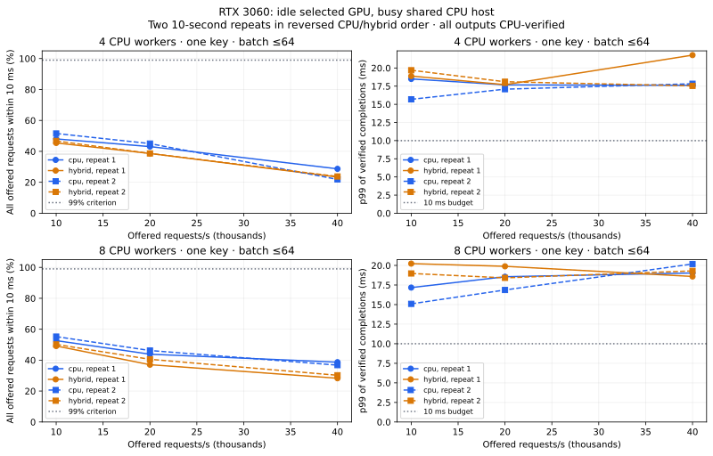

# RTX 3060: repeated request-pipeline measurements

**0 of 6 paired short-run settings met the predeclared criterion:** at least 99% of all offered requests within 10 ms in both CPU and hybrid modes in both repeats. The selected RTX 3060 passed its idle preflight; the shared CPU and RTX 4070 Ti remained available to unrelated work. These are measurements of this shared host, not exclusive capacity or a production savings claim.

This September 5, 2026 campaign follows a [plan committed before measurement](../benchmarks/RTX3060_CAMPAIGN.md). It uses the existing v0.3 native engine with atomic key epochs, full-window P-256 signing and independent CPU verification of every output before completing a batch. The CPU baseline uses cached native OpenSSL contexts, deterministic nonces and the same verification policy. No rental was provisioned.

## What was measured

- NVIDIA GeForce RTX 3060, 12 GB, device 1, display disabled; Ryzen 7 7800X3D, 16 logical CPUs; Windows, driver 610.62, CUDA 13.0.88, MSVC 19.44 and native OpenSSL 3.5.8.
- 512-byte synthetic records; maximum batch 64; GPU minimum 64; 1 ms oldest-request fill wait; caller dispatch; 8,192 queued requests plus bounded in-flight batches. The 10 ms budget is an explicit experiment assumption.
- Two 10-second sweeps at 4/8 workers, one key and 10k/20k/40k offered requests/s. CPU runs first in repeat 1; hybrid runs first in repeat 2. Four 30-second checks use 8 workers, 40k/s and one or sixteen keys.
- After the 10 ms misses appeared, a separately predeclared 50 ms control repeats the one-key, 8-worker, 40k/s case twice in opposite mode order, 30 seconds/cell. Original 10 ms outcomes and criteria remain unchanged.
- Latency starts at planned arrival and ends only after the entire output batch passes verification. Queueing, preparation, CPU hashing, signing, transfers and verification are included. Key setup, warm-up, network, TLS, authorization, payment, persistence and redundancy are excluded.

There are **32 new rows**, **15,200,000 offered requests**, **12,167,746 independently verified completions**, and **0 verification/processing failures**. Timed workload totals 480 seconds; setup and preflight add elapsed time. Rejection, expiry and late completion are separate outcomes retained in [raw captures](../benchmarks/pipeline_results) and the [CSV](../benchmarks/pipeline.csv). Counts and histograms are checked, not independently attested.

## Host conditions

Before individual cells, sampled aggregate CPU utilization ranged **26.1–71.7%**; during cells it ranged **31.2–100.0%**, including benchmark work. The other GPU's preflight utilization ranged **3–99%**. The final three selected-GPU observations before each cell ranged **0–1%**, within the 5% gate. These samples cannot prove that every interval was interference-free.

Windows aggregate CPU utilization is calculated from successive GetSystemTimes counters: subtract idle time from kernel plus user time, then divide by total time. Kernel time already includes idle time. Process CPU seconds are recorded separately for the native benchmark; parent telemetry work is outside that process counter. GPU power readings are board telemetry, not wall-system energy. [Microsoft API semantics](https://learn.microsoft.com/en-us/windows/win32/api/processthreadsapi/nf-processthreadsapi-getsystemtimes).

The harness requests a 1 ms Windows timer period and restores it at exit; that request is not a scheduling or deadline guarantee. Effective wake-up timing and host interference were not separately isolated in this campaign, so the missed deadlines cannot be attributed solely to cryptographic execution. [Windows timer-resolution behavior](https://learn.microsoft.com/en-us/windows/win32/api/timeapi/nf-timeapi-timebeginperiod).

## Both short repeats

Ranges below span the two observations; they are not confidence intervals. The pass criterion includes all offered requests, so dropping or expiring requests cannot improve it. p99 covers verified completions only and must be read together with the deadline-success fraction.

| Workers | Offered/s | CPU / hybrid goodput/s | CPU / hybrid within 10 ms | CPU / hybrid p99 ms | Hybrid GPU share | Both repeats pass? |
|---:|---:|---|---|---|---:|---|
| 4 | 10,000 | 4,799–5,151 / 4,539–4,667 | 48.05–51.56% / 45.44–46.72% | 15.69–18.50 / 18.89–19.69 | 27.4–31.7% | No |
| 4 | 20,000 | 8,607–8,998 / 7,717–7,722 | 43.09–45.03% / 38.63–38.67% | 17.09–17.68 / 17.70–18.11 | 42.4–43.0% | No |
| 4 | 40,000 | 8,742–11,468 / 9,338–9,498 | 21.88–28.70% / 23.39–23.77% | 17.61–17.83 / 17.54–21.78 | 74.9–75.3% | No |
| 8 | 10,000 | 5,258–5,519 / 4,905–5,009 | 52.62–55.23% / 49.13–50.17% | 15.09–17.17 / 18.97–20.23 | 22.9–23.5% | No |
| 8 | 20,000 | 8,752–9,234 / 7,400–8,100 | 43.83–46.22% / 37.05–40.55% | 16.87–18.56 / 18.41–19.89 | 38.5–40.7% | No |
| 8 | 40,000 | 14,680–15,457 / 11,302–12,075 | 36.77–38.68% / 28.29–30.22% | 19.04–20.18 / 18.59–19.30 | 62.4–64.4% | No |



## Longer runs and key fragmentation

Each row below is a single 30-second run at 40,000 offered requests/s with 8 CPU workers. It is a longer check, not long-duration production qualification. GPU share is the fraction of verified requests signed on the GPU; a hybrid row with little GPU work primarily measures CPU routing.

Uniformly splitting 40,000 requests/s across sixteen keys gives 2,500 compatible arrivals/s per key. In an ideal evenly spaced stream, the first item would wait 63/2,500 = 25.2 ms to assemble 64 items without a timeout. The configured 1 ms flush therefore favors smaller CPU batches. This is a fill-time calculation; the measured GPU share below records what the actual scheduler did.

| Keys | Mode | Goodput/s | Within 10 ms | p99 ms | GPU share | Process CPU seconds | Mean occupied CPU cores |
|---:|---|---:|---:|---:|---:|---:|---:|
| 1 | cpu | 8,432 | 21.09% | 28.54 | 0.00% | 107.703 | 3.59 |
| 1 | hybrid | 5,859 | 14.66% | 19.24 | 72.66% | 66.859 | 2.23 |
| 16 | cpu | 16,296 | 40.76% | 14.31 | 0.00% | 77.625 | 2.59 |
| 16 | hybrid | 26,827 | 67.07% | 13.22 | 0.00% | 115.797 | 3.86 |

**The sixteen-key hybrid run signed every completed request on CPU.** Its different goodput reflects CPU batching/routing behavior and recorded host conditions; it establishes no GPU acceleration. Compatible-key arrival rate, rather than total traffic alone, determines whether this GPU threshold is reached.

The per-stage counters below sum worker wall time, which can overlap across workers and includes preemption/waiting. They are not a CPU-time or total-latency decomposition. In particular, GPU signing includes mutex/driver wait as well as execution; completion verification still consumes CPU work.

| Keys | Mode | Prepare worker-s | Sign worker-s | Verify worker-s | Expired | Late | Rejected |
|---:|---|---:|---:|---:|---:|---:|---:|
| 1 | cpu | 1.323 | 36.245 | 69.665 | 386,518 | 560,439 | 0 |
| 1 | hybrid | 1.024 | 43.096 | 57.976 | 391,884 | 632,243 | 0 |
| 16 | cpu | 1.189 | 31.675 | 63.074 | 502,075 | 208,816 | 0 |
| 16 | hybrid | 1.661 | 37.716 | 75.090 | 280,599 | 114,548 | 0 |

## Cost interpretation

For fully allocated system cost **H dollars/hour**, multiply the coefficient below by H to obtain dollars per million requests completed within 10 ms under the recorded conditions. These are arithmetic coefficients, not measured electricity bills or recommended deployment prices. They preserve deadline misses in the denominator; quality must pass before using them for sizing.

| 30-second setting | Cost per million per $1/hour | Deadline quality (≥99%) |
|---|---:|---|
| 1 keys, cpu | 0.032942 × H | Fail |
| 1 keys, hybrid | 0.047407 × H | Fail |
| 16 keys, cpu | 0.017046 × H | Fail |
| 16 keys, hybrid | 0.010354 × H | Fail |

## 50 ms deadline control

The [control plan](../benchmarks/RTX3060_DEADLINE_CONTROL.md) was committed before these four runs, after seeing the early 10 ms misses. The budget is changed to 50 ms with the same binaries, record size, worker count, key count, batch size and offered rate as the 8-worker, one-key, 40k/s scenario. New arrivals were generated: this is not a relabeling of earlier completions. The original deadline remains visible above.

| Repeat | Mode | Goodput/s | All offered within 50 ms | p99 ms | GPU share | Process CPU seconds | Mean occupied CPU cores | Cost coefficient × H |
|---:|---|---:|---:|---:|---:|---:|---:|---:|
| 1 | cpu | 39,991 | 100.00% | 10.58 | 0.00% | 118.203 | 3.94 | 0.006946 |
| 1 | hybrid | 39,911 | 99.79% | 30.45 | 25.09% | 116.922 | 3.90 | 0.006960 |
| 2 | hybrid | 39,990 | 100.00% | 23.62 | 35.69% | 116.891 | 3.90 | 0.006946 |
| 2 | cpu | 37,930 | 94.84% | 62.75 | 0.00% | 126.859 | 4.23 | 0.007323 |

The four 50 ms cells **fail** the criterion that every cell complete at least 99% of all offered requests within budget. Matched hybrid/CPU goodput ratios are **0.9980–1.0543**. This ratio is also the arithmetic break-even ratio of total hybrid/CPU hourly costs at this traffic level; it is not a measured capacity ratio or savings claim. The failed quality gate prevents using this ratio as an adoption case.

The longer budget allows more work to reach signing and verification before expiration, changing resource demand. Compare process CPU seconds and actual GPU share at the same budget. These sequential shared-host trials cannot establish that a CPU-use difference was caused solely by GPU offload.

Actual RTX 3060 capital allocation, lifetime, wall-system energy, electricity rate and shared CPU/RAM costs remain inputs to the [owned-system model](ECONOMICS.md#owned-cards-and-utilization). Include the CPU host once. Process CPU savings do not automatically reduce the cost of an already provisioned machine. The dated A100/L40S provider-price scenarios remain separate from these local measurements.

The useful engineering result is a measured CPU/GPU request path with explicit quality and resource accounting. Moving signing onto an available GPU does not by itself establish a 10 ms service or an economic gain. An exclusive host and representative traffic/deadlines are still needed to separate scheduling interference from application capacity; longer burst/skew/recovery tests and the [production security work](PRODUCTION_READINESS.md) also remain open.

## Reproduce and inspect

Use the [committed campaign plan](../benchmarks/RTX3060_CAMPAIGN.md) for matrix settings and the [native build instructions](PIPELINE_RESULTS.md#reproduce) for prerequisites. Select the actual device index; this host's device 1 reports an RTX 3060. `--preflight-scope target-gpu` requires that selected GPU to be idle and explicitly records the shared CPU host. Default preflight still checks all GPUs.

```sh
python benchmarks/verify_pipeline.py
python benchmarks/report_pipeline.py --check
python benchmarks/report_rtx3060.py --check
# Optional chart regeneration requires matplotlib:
python benchmarks/report_rtx3060.py --plot
```

Source commits, binary fingerprints, exact commands and timestamps are in each capture. The [build manifest](../benchmarks/pipeline_build.json) identifies the native/OpenSSL binaries. The earlier 84 diagnostic rows remain unchanged and separately qualified; this campaign adds selected-device preflight, per-cell CPU/GPU telemetry and reversed-order repeats.
