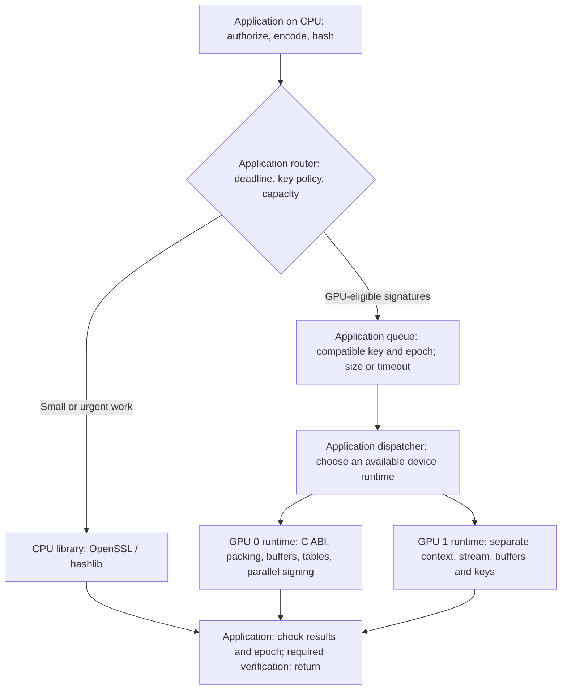

# Designing a CPU–GPU cryptography service

The useful unit of evaluation is a complete request processed correctly within its deadline. A fast signing kernel helps only if preparation, compatible batch formation, transfers, key handling and result processing leave enough time and capacity for it to matter.

GPU Batch Crypto supplies explicit CPU operations and a synchronous CUDA batch engine. The routing and queueing design below describes an integration an adopter could build. Version 0.3 also supplies a [native in-process pipeline benchmark](PIPELINE_RESULTS.md) with bounded queues, timed batches, CPU/hybrid routing and independent verification. That harness is an executable experiment, not a network service. The [library architecture](ARCHITECTURE.md) identifies the implemented components.

## Assign work according to the evidence

| Work | Starting placement for evaluation | Reason and evidence boundary |
|---|---|---|
| Authentication, authorization, canonical encoding, routing, deadlines and key policy | Application/CPU | These establish what may be signed or encrypted and are outside the CUDA library. |
| Content hashing and AES-GCM | CPU initially | CPU won every sampled cell in the [v0.1 matrix](RESULTS.md). CUDA implementations remain available for testing other shapes; v0.2 establishes no new AES/hash advantage. |
| Sparse or urgent P-256 signing | CPU initially | Full-window GPU signing lost at batches 1 and 8 in all four v0.2 captures. Waiting for more work can dominate execution time. |
| Many compatible P-256 signatures ready together | Evaluate GPU full-window | First sampled CPU crossover was 64. Batch 256 gave the most consistent mid-size result across the two local runs per GPU. |
| Key generation and independent signature verification | CPU | The provided standard-library paths run on CPU. The GPU timing excludes independent oracle verification; include required verification in the service budget. |

CPU batching remains a valid alternative. Cached keys, native calls, vectorized work where supported, multiple cores and efficient memory management deserve the same attention as GPU tuning. The published CPU comparison is one Python thread with cached OpenSSL keys; it does not establish the capacity of a fully optimized CPU server.

## Proposed request flow



The CPU library and GPU runtime nodes are implemented. Admission, routing, timed queues, multi-device dispatch and request completion policy are application components in this design. A single-GPU deployment uses one GPU node. No multi-GPU speedup has been measured here.

For a signing workload, the CPU can hash content and send the GPU only 32-byte digests; the GPU returns 64-byte signatures. A 256-item call therefore carries 24 KiB of digest/signature bytes across both directions, plus key, status and other overhead. There is no need to transfer full articles merely to sign their hashes. The CPU must construct the correct, domain-separated message to hash; signing arbitrary caller-supplied digests requires an appropriate trust policy.

The runtime reuses GPU work buffers and public precomputation tables. Key slots reside in native host memory; the signing key is copied to a temporary device buffer during each call. Key import into a context is not persistent secret-key storage on the GPU. Temporary work buffers follow the library's clearing policy. See [security scope](../SECURITY.md).

Calls on one context serialize. Independent contexts have independent streams, but the public calls remain synchronous and the current engine synchronizes its transfers. An integration can use host workers to pipeline CPU preparation and independent calls; it must measure the actual overlap and contention. This API does not promise asynchronous completion or automatic copy/compute overlap.

## Why batching changes the CPU–GPU comparison

A GPU call pays fixed work for submission and synchronization, work proportional to bytes for packing and transfer, and work proportional to the cryptographic batch. Enough independent records can share those costs and occupy more GPU execution resources. A small batch pays much of the same overhead while exposing little parallel work.

For the warmed synchronous path, a useful accounting model is:

```text
T_call(B) = host packing + transfers + GPU work + synchronization
            + result construction + buffer clearing
batch throughput = B / T_call(B)

request latency = preparation + batch-fill wait + device-queue wait
                  + T_call(B) + required verification + response overhead
```

The [recorded call timings](P256_RESULTS.md) include all of `T_call`, but do not separately attribute its components. Key/table import, batch formation, application queueing and independent oracle checks are excluded. The reciprocal of throughput is amortized cost per item, not the time an individual request waits.

At batch 256, full-window RTX 4070 Ti recorded **224,742–229,039 signatures/s** at **1.12–1.14 ms** mean call time. The same runs' CPU baselines recorded **41,218–44,130/s**, making the paired rate ratios **5.09–5.56×**. RTX 3060 recorded **177,810–194,276/s** at **1.32–1.44 ms**, with paired CPU ratios **4.10–4.77×**. These are two short local runs per card, not service capacity guarantees or cost savings.

Batch 64 first beat CPU in the sampled full-window sweep; batches 1 and 8 did not. At 1,024 and 4,096, large variability changed the apparent optimum between repeats. Increasing batch size indefinitely is not supported by these results. [Both captures](P256_RESULTS.md) are retained.

## Traffic per compatible key determines fill time

Let `lambda` be compatible arrivals per second and `B` the target batch. For evenly spaced arrivals, a batch beginning with its first item, no timeout and no preceding queue:

```text
first-item fill wait = (B - 1) / lambda
mean fill wait      = (B - 1) / (2 * lambda)
```

The following is a calculated illustration using `B = 256` and a rounded **1.14 ms** observed 4070 Ti mean call time. It is not a traffic replay or latency measurement. The last column excludes preparation, device queueing, verification and transport, and assumes the same call time at each arrival rate.

| Compatible arrivals/s | Mean fill wait | First-item fill wait | Mean fill wait + assumed call time |
|---:|---:|---:|---:|
| 100,000 | 1.275 ms | 2.55 ms | 2.415 ms |
| 10,000 | 12.75 ms | 25.5 ms | 13.89 ms |
| 1,000 | 127.5 ms | 255 ms | 128.64 ms |

A service receiving 100,000 requests/s spread evenly across 100 incompatible signing-key groups has only 1,000 compatible arrivals/s per group. It has the third row's fill cost, despite a high aggregate request rate. Traffic skew changes which groups can form useful batches. A size threshold alone can leave a sparse group waiting indefinitely; a timer is necessary in an online service.

For example, an assumed 5 ms remaining budget and 1.14 ms call time leave at most 3.86 ms for filling even before accounting for other costs. Filling 256 items from the first arrival would require about **66,062 compatible arrivals/s** in this deterministic model. This is a feasibility calculation, not a 5 ms SLA: a mean call time cannot establish a tail deadline, and bursts, contention and partial batches change the result.

## Routing, epochs and overload

An integration should group work only when the operation, format, tenant/trust policy, signing key and intended epoch are compatible. The current ABI accepts one key slot per signing batch. Public table contents are key-independent, while each context still owns its table allocation; secret-key policy cannot be inferred from shared mathematical constants.

Dispatch when the target size is reached or the oldest item's allowed wait expires. At timeout, evaluate the partial batch against the current CPU/GPU profiles and remaining deadline. Select a CPU path before submission only when that path is permitted to hold the key and execute the operation. Routing also depends on each device's queued work and health, not just its nominal signatures/s.

Bind queued work to the intended key generation. Version 0.3's `bc_sign_at_epoch` checks that generation atomically with dispatch under the context mutex; stale work fails before GPU execution. `bc_seal_at_epoch` and `bc_open_at_epoch` provide the same property. Python exposes `expected_epoch`; the guarded signer requires it and verifies every output. Legacy `bc_sign` still uses the current slot generation. Applications must decide whether to discard, reauthorize or explicitly requeue stale work; silently replacing its requested epoch defeats that policy.

Use bounded per-key and per-device queues and an admission policy. When offered work exceeds measured service capacity, additional queueing increases latency; it does not create capacity. Reject, defer or route work according to application policy and record that decision. A CUDA call failure is explicit; the library does not silently switch to CPU. Retries require operation-aware handling and duplicate accounting. AES nonce allocation must remain correct across workers, routes and retries.

For multiple GPUs, each runtime owns its device selection, buffers and key slots. A dispatcher can assign compatible batches to ready devices based on measured completion and queue age. Splitting every key's incoming traffic into separate per-device fill queues can make batches slower to fill. More GPUs also consume CPU dispatch, memory and verification capacity. Neither linear scaling nor a shared secret-key store follows from creating more contexts.

## Make the whole-system numbers add up

For a pipeline with independent stage resources, sustained throughput cannot exceed its slowest stage. CPU preparation, routing and verification often share cores, so their combined demand matters too. GPU transfer and clearing work already inside `T_call` must not be counted as additional measured acceleration.

Two simple models help frame the next experiment:

```text
ideal speedup bound = 1 / ((1 - f) + f / s)
```

Here `f` is the fraction of the original request's time spent in the work being accelerated and `s` is that work's speedup. This serial accounting model ignores new queue and offload overhead. If signing occupied 20% of request time and became 5× faster, the ideal request speedup would be only **1.19×**, before those additional costs. This is an illustration, not a measured application result.

For capacity, if aggregate CPU work takes `h` CPU-seconds per request across preparation, dispatch and required verification, and `c` effective CPU-seconds/s are available for that work, its ideal upper bound is `c / h` requests/s. Measure `h` under the intended concurrency; do not estimate a multi-core baseline by multiplying the published single-thread rate. The GPU engine still needs those CPU resources.

For economics, define goodput as successful application operations completed within the agreed latency target. Use the same operation semantics, verification policy, availability target and load trace for both systems:

```text
cost per million = 1,000,000 * fully allocated hourly system cost
                   / (3,600 * measured goodput per second)
```

Include CPU host capacity, GPU allocation, idle time, memory, relevant transport and the deployment's failure/redundancy requirements. A shared GPU needs an allocation and contention policy; an already owned GPU still has capacity and operating costs. The [cost model and GPU inventory](ECONOMICS.md) price the existing primitive captures with explicit assumptions. The [native pipeline experiment](PIPELINE_RESULTS.md) adds within-SLO goodput and process CPU time. Neither includes a network deployment or establishes publisher revenue.

## Evidence needed for an adoption decision

| Decision | Measure next | What this repository currently supplies |
|---|---|---|
| Does the workload fit? | Fresh-signature fraction, arrival/burst distribution, active key groups, payloads and deadlines | Primitive contracts and examples; no production traffic trace |
| Is GPU assistance better than CPU alone? | Same workload through an optimized native multi-core CPU baseline and the hybrid service, with identical checks | Cached single-thread CPU baseline and full synchronous GPU calls |
| Can requests meet their deadline? | Preparation, fill wait, queue wait, call time, verification and response p50/p95/p99; rejected work too | Short-run call samples; historical scheduler percentiles from different implementations |
| Does it hold under sustained load? | Repeated long runs, temperature/clocks/utilization, overload, recovery and shared-host contention | Two local v0.2 runs per GPU; large-batch variability disclosed |
| Does it scale across keys and devices? | Key skew, rotation under queued work, CPU saturation, per-device queues and multi-GPU goodput | Independent contexts and key epochs; no service scheduler or scaling claim |
| Is the security boundary acceptable? | Key residency and isolation requirements, side-channel review, failure policy and independent review | Known limitations, interoperability tests and source provenance; no independent audit |
| Is the business case positive? | Goodput and total resource cost at the required latency and availability | Reproducible primitive evidence; no demonstrated publisher revenue or deployment ROI |

Choose the workload, latency target, verification policy and success criteria before running that comparison. Report rejected, failed and late work alongside successful throughput. A credible deployment decision needs those results as well as the kernel and library numbers.
